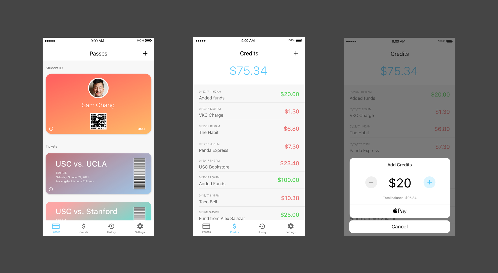
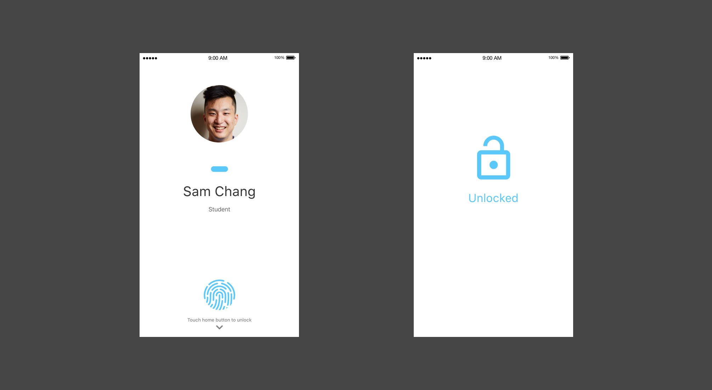
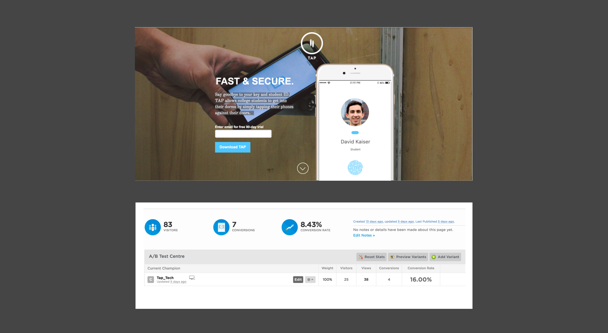
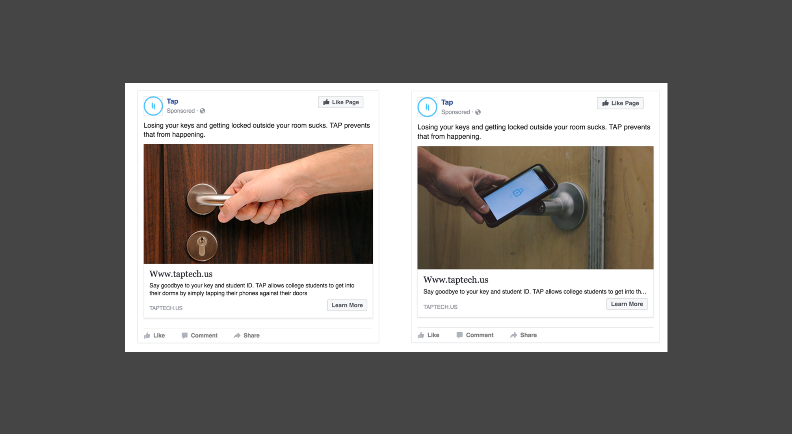

<content-title>
TAP
</content-title>
<content-excerpt>
Conceptualizing a better, faster, and more secure way of accessing amenities on campus 
</content-excerpt>
<content-header>
Introduction
</content-header>
<content>
TAP is a short side project I worked on at USC. I conceptualized an app that could be used by college students on their campuses. The idea was to replace the student ID card with a mobile app and offer unique features that solve common problems that students face.
</content>

<content-header>
User Problem
</content-header>
<content>
I came up with TAP after I lost my ID card for the fifth time. As a student your ID card is your unique key that enables you to access a variety of amenities on campus—access to dorms, the gym, dining halls, and classrooms. Losing your ID card is annoying as it’s pricey to replace and inconvenient depending on when you lose it. For example, if you lived in the dorms and lost your ID card at 2 A.M., you’d have to wait until the following morning to buy a replacement card. In the meantime you’d have to rely on your roommates or RA to let you back in. Gross. Not fun.
</content>
<content>
So as I was walking to the office to get my card replaced I thought to myself: “How can I never encounter this situation again?” It then hit me that we had to use physical cards at all in the first place. Why not use your mobile phone instead? Instead of swiping your card why not tap your phone against a lock using its NFC antenna? A mobile app that replaces your ID card would be faster, more secure, and convenient.
</content>
<content>
Services like Apple Pay, for example, have replaced the need to carry around debit cards. Plus, millennials like me have our phones glued to our hands like it was our Horcrux, so the chances of losing our phones compared to our ID card are relatively lower.
</content>
<content>
<strong>So, the value that TAP brings to college students is giving faster and more secure access to amenities on their campuses.</strong>
</content>
<content-header>
Process
</content-header>
<content>
<ol>
<li>Surveyed college students to validate my problem hypothesis</li>
<li>Analyzed competitors</li>
<li>Ideated key experiences and features</li>
<li>Created visual mockups and interactive prototype to test</li>
<li>Created a landing page and Facebook advertisement campaign to determine product/market fit</li>
</ol>
</content>

<content-header>
Features
</content-header>
<content>
<ol>
<li>Access amenities on campus</li>
<li>Store game tickets into app</li>
<li>Add discretionary funds to student account</li>
</ol>
</content>

<gif>

</gif>

