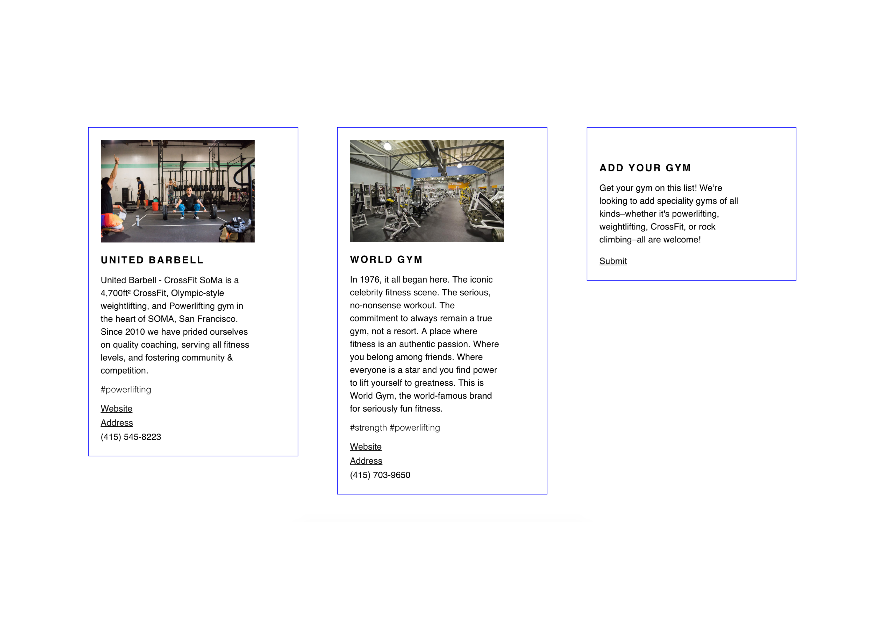
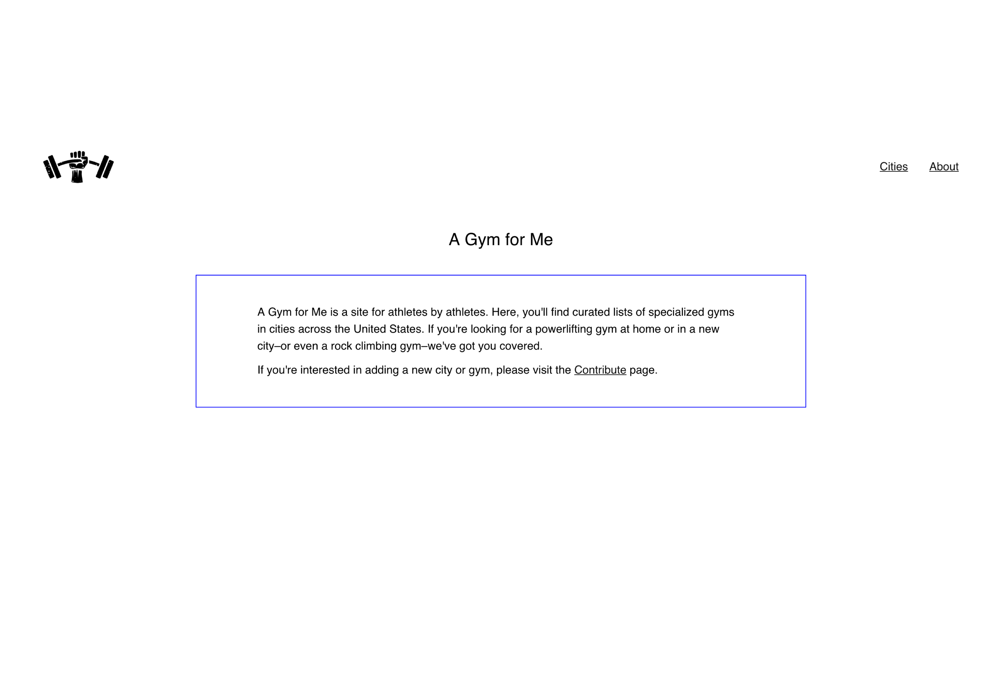

<content-title>
A Gym for Me
</content-title>
<content-excerpt>
Curated lists of specialized gyms 
</content-excerpt>

<content-header>
Introduction
</content-header>

# I love lifting, and I love web development. Wanting to merge these two interests, I created A Gym For Me, a site built in <a href="https://reactjs.org/">React</a>.

# A Gym for Me is a site for athletes by athletes. It contains curated lists of specialized gyms in cities across the United States.

# The code that powers A Gym for Me is <a href="https://github.com/skrapkam/gym-finder">open source</a>. 🏋️

<blog-button>
<button-visit>
<a href="https://agymfor.me/">Visit</a>
</blog-button>

