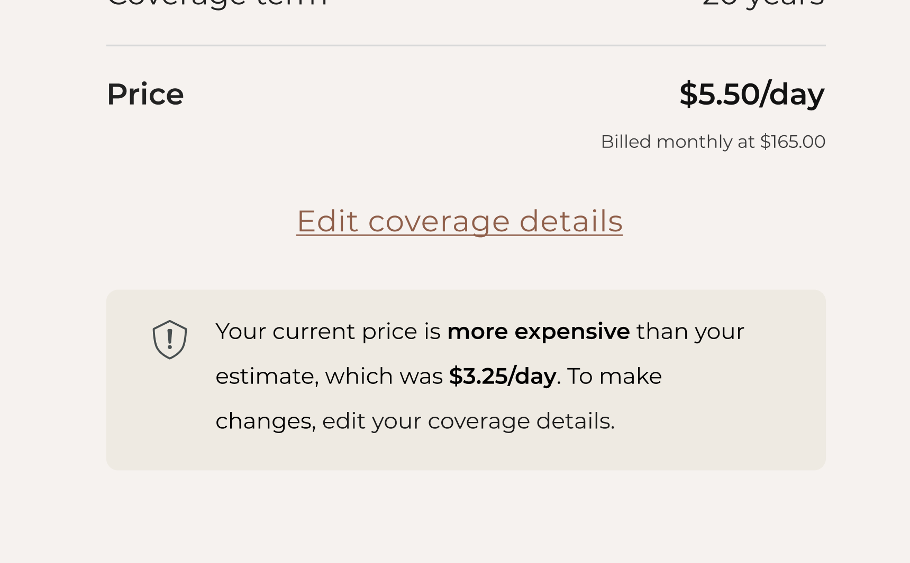
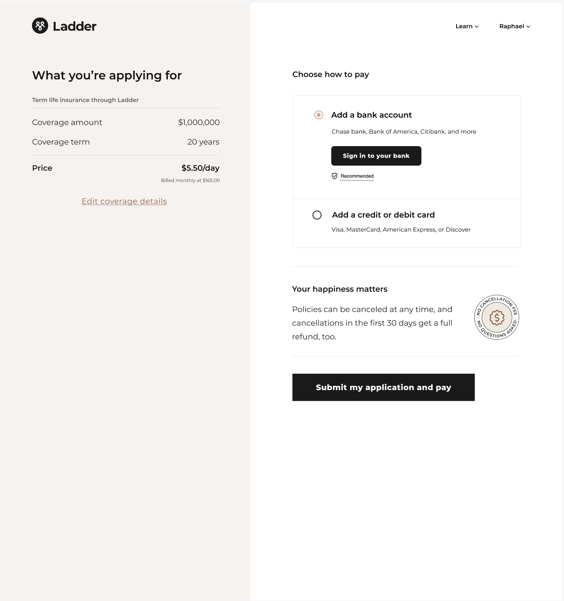
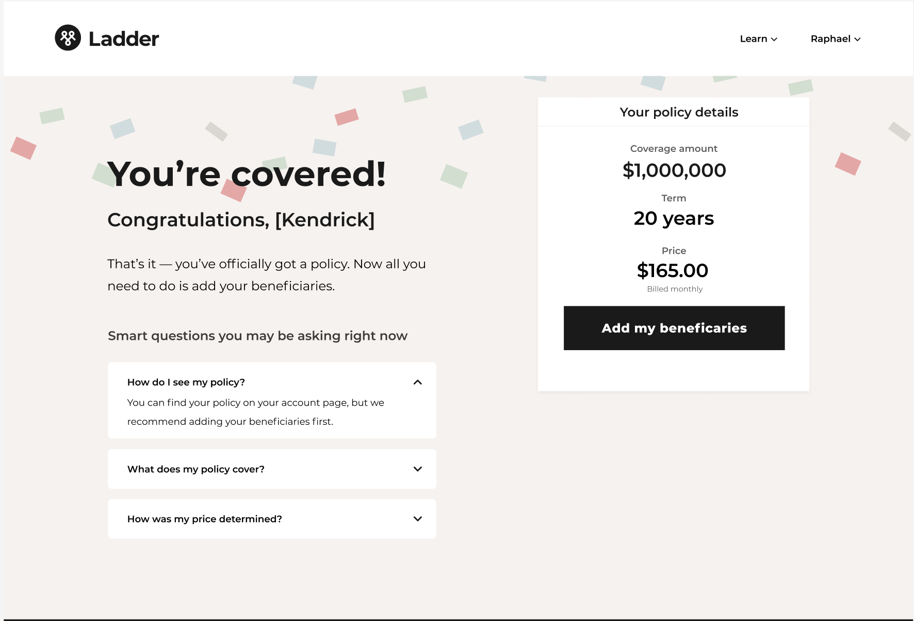
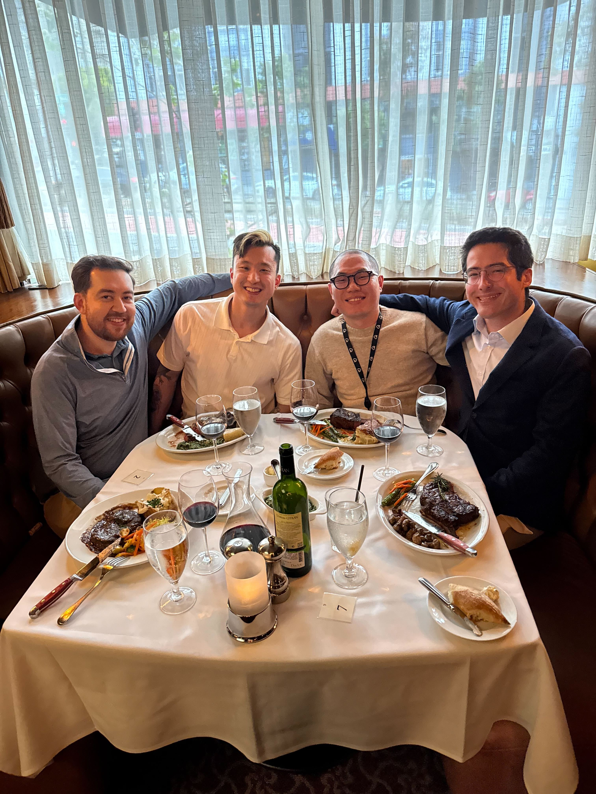

<visual>
<content-title>
Billing Checkout
</content-title>
</visual>

<content-excerpt>
Redesigning Ladder's purchase experience to reduce wasted costs and better serve high-intent users.
</content-excerpt>

I redesigned Ladder's purchase flow to focus on high-intent users by auto-issuing matching-price policies and requiring payment details up front to confirm intent. Despite initial risks and tension with leadership, the launch increased gross margin by 82% and reduced costs by 64%.

<prompt-container>
<clickable-prompt prompt="What problem were you solving with this project?" projectContext="Ladder Billing Checkout">What problem did you solve?</clickable-prompt>
<clickable-prompt prompt="What was your process?" projectContext="Ladder Billing Checkout">What was your process?</clickable-prompt>
<clickable-prompt prompt="What constraints shaped your work?" projectContext="Ladder Billing Checkout">What constraints shaped your work?</clickable-prompt>
<clickable-prompt prompt="What impact did it have?" projectContext="Ladder Billing Checkout">What impact did it have?</clickable-prompt>
</prompt-container>

 
# Background

## What is this?

<visual>

Ladder's mission is to protect families by making it easier for people to secure coverage. Like any product, policies come with costs, which we recover through sales revenue. Over the past few years, our company faced challenges in selling policies efficiently, with revenue impacted by spending on individuals who ultimately didn't make a purchase. In 2024, I designed a solution that transformed how policies are evaluated and purchased, significantly improving our contribution margin.

</visual>

## My role

I was the Lead Designer on this project, which lasted five months.

# Problems to solve

Ladder has long faced the challenge of underwriting users who don’t end up purchasing a policy, leading to high operational costs. The purchase journey typically begins with a user receiving a quote, completing an application, and—if everything checks out—reviewing and accepting their offer.

Behind the scenes, Ladder invests heavily in underwriting users by evaluating their risk profiles. This process includes gathering medical history, driver's license information, and other data. Based on their application and underwriting results, we provide an offer for the user to consider.

The challenge arises when users we’ve invested in don’t accept their offers. Reasons for this include price concerns, lack of readiness, or continued shopping. While these decisions are understandable, they create issues for both users and our business:

1. **User challenges**
   1. Users invest time in our process but may leave without a policy, leaving their families unprotected.  
   2. For users who already liked their initial quote, having to accept an offer at the same price adds an unnecessary step in an already lengthy process.  
2. **Business challenges**
   1. Spending on underwriting for users who don’t purchase negatively impacts our contribution margins.  
   2. Strong contribution margins are crucial for fundraising in the startup world, where investors prioritize high gross margins.  

# Goals

Our primary goal was to focus on high-intent users—those who are ready and willing to purchase a policy. In contrast, low-intent users are individuals who are not yet prepared to buy for reasons such as price concerns, needing to consult with family, or continuing to shop around. Through past research, we identified cohorts of users who proceed through our life insurance flow without any intention of purchasing. Our objective was to avoid spending underwriting money on these low-intent users.

## Measures of success

- **Increase Policy Growth.** Make it easier for high-intent users to accept their offers, reducing the risk of losing their business due to unnecessary friction in the process.

- **Enhance Contribution Margins.** Accurately gauge user intent to determine if spending underwriting costs is justified, thereby reducing wasted resources on low-intent users.

# My process

Understand → Identify → Execute

## Understand

### Understanding the traditional purchase journey

Most digital life insurance websites follow a similar process: users start with a quote, complete a detailed questionnaire, then receive a finalized offer that may differ from their initial quote. If satisfied, they accept the offer and provide billing information to activate their policy.

This step-by-step process—Quote → Questionnaire → Offer → Billing—is a standard approach across digital insurance providers. Its familiarity helps users intuitively understand the process.

### Understanding underwriting

Behind the scenes, accurately assessing a user’s risk is essential for generating a fair and competitive price. Ladder leverages a range of digital services to quickly and thoroughly evaluate a user’s risk profile. This modern approach eliminates the need for traditional methods like doctor visits and blood tests, making digital life insurance faster and more convenient.

## Identify

### Identifying the approaches

With a clear understanding of the current flow, our team brainstormed ways to reconfigure the traditional process. We hypothesized two potential approaches:

1. **Automatically issuing a policy** if the final price matches the initial quote. This would eliminate the extra acceptance step when nothing has changed.  
2. **Requiring payment details earlier in the flow** to filter for intent. High-intent users would proceed, while low-intent users would drop off. Underwriting wouldn’t begin until after payment information was provided.  

### Identifying the risks

These approaches marked a significant departure from the traditional purchasing journey, and the risks were substantial. Users might feel caught off guard by skipping the traditional offer step, or hesitant about sharing payment details before seeing a finalized offer. This could result in negative reviews, frustrated calls to our customer service team, and drop-off at the billing stage.

## Execute

### Design explorations

A key challenge was structuring the page hierarchy—deciding what to emphasize between the quote, billing, and next steps. I collaborated with our content designer to ensure clarity in both layout and copy.

To evaluate options, I explored three main directions:

**Exploration A — Combined Review + Quote**  
- **Pros**: Combines the quote section with the existing review screen (for application answers), removing a step. Feels natural—reviewing quote + answers together.  
- **Cons**: The page becomes heavy with information, which could overwhelm users and increase drop-off.  

**Exploration B — Checkout Mental Model**  
- **Pros**: Very familiar “checkout” mental model, which gives users confidence they’re completing a purchase.  
- **Cons**: Could feel premature to enter payment before seeing a formal offer.  
- **Trade-off**: Strongest for high-intent users, but increases risk of early drop-off for uncertain ones.  

**Exploration C — Singular Recap Page**  
- **Pros**: Singular view can feel less intimidating than multiple steps. Step-by-step flows can feel daunting, requiring commitment at each point. Bite-sized directives reduce cognitive load.  
- **Cons**: Heavier engineering lift, expanding project scope.  
- **Trade-off**: Easier to communicate expectations, but more complex to build.  

### Why we chose B

We ultimately chose Exploration B. Exploration A, though efficient in reducing steps, created a dense page that risked overwhelming users. Exploration C was appealing from a UX perspective but posed a heavier engineering lift, expanding scope beyond what was feasible for the quarter. Exploration B struck the best balance: it leveraged a familiar checkout mental model to give users confidence, filtered effectively for intent, and was achievable within our engineering timeline.  

<visual>

My approach was to frame this step similarly to a checkout page, providing users with a clear summary of what they’re purchasing, the cost, and an opportunity to enter payment details.

</visual>

We also brought in a proven conversion component: our cancellation policy.  

<visual>

# What we shipped

After this iterative design and alignment process, here’s what we ultimately shipped:  

# Results

We launched this project in May 2024 and rigorously tracked experiment data over the following weeks to validate results.  

- **Gross margin increased by 82%**  
- **Underwriting costs reduced by 64%**  

</visual>

While contribution margins improved significantly, policy volume decreased by 6%. This was an expected tradeoff of filtering more aggressively for high-intent users. The reduction in volume was offset by the improved margins, which were ultimately more important for company sustainability. Still, I pushed senior stakeholders to keep investing in this area to understand why policy growth dipped and how we could address it without sacrificing margins.  

I led user research with customers who had dropped off, and partnered with our customer support team to analyze common questions. We discovered that many users left the billing checkout page due to unanswered concerns. In a follow-up iteration, I designed an FAQ/resource center within the checkout experience, including answers to frequent questions, direct access to customer support, and a sample policy PDF. This addition drove a **2% increase in policy growth**, helping recover volume while maintaining improved margins.  

From a user experience perspective, customer support volume remained stable — no spike in complaints or confusion. Post-launch feedback suggested users appreciated the clearer checkout-like framing, which made the process feel more familiar and decisive. After adding the FAQ/resource center, we saw fewer clarification tickets and heard directly from users that having a sample policy PDF gave them confidence to move forward.  

<visual>

<callout emoji ="📈">
This project improved gross margins by 82%, reduced costs by 64%, became a cornerstone of Ladder’s fundraising story — a major reason we secured our Series D funding — and, through iteration, recovered 2% in policy growth.
</callout>  

# Impact on company

This project became one of Ladder’s most impactful initiatives in 2024. By strengthening our contribution margins and recovering policy growth, we created a compelling narrative about the company’s current performance and future trajectory — an invaluable asset in securing Series D funding and extending Ladder’s runway.  

</visual>

