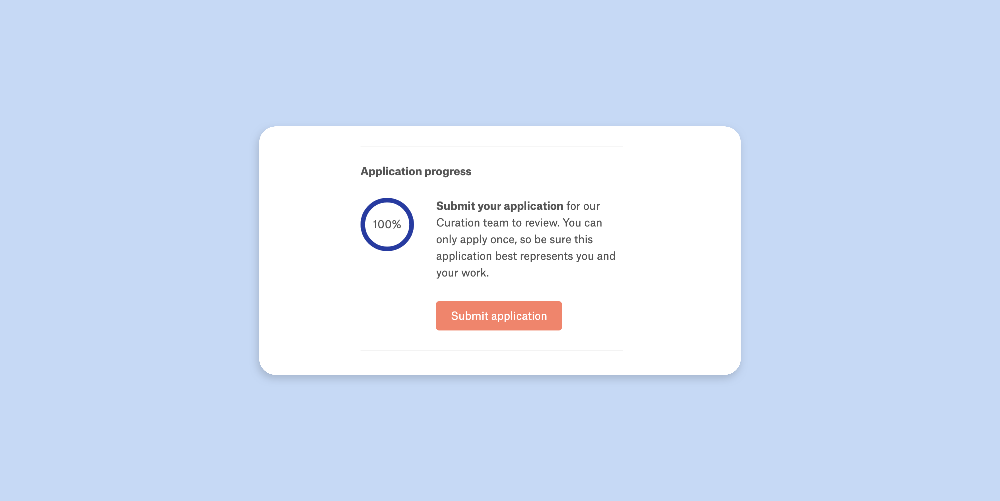
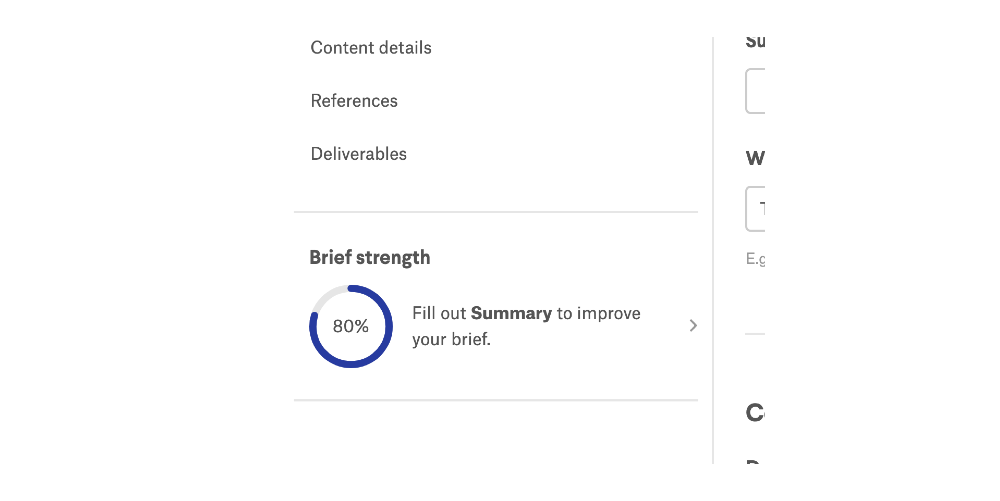
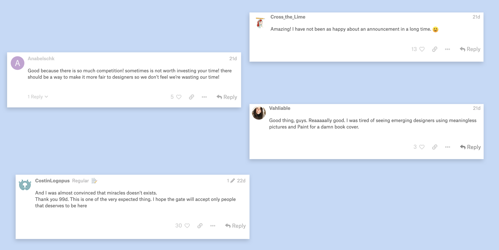

<content-title>
Onboarding
</content-title>
<content-excerpt>
Overhauling 99designs' designer onboarding experience.
</content-excerpt>

I led the design of a new onboarding process for designers. This new and improved process is helping 99designs find great designers, improving the quality of work on the platform, and saving the company over $230,000 a year.

<content-header>
Introduction
</content-header>

##Background

#The designer community is [99designs](https://99designs.com)’ greatest asset. Over the past 10 years 99d has invested in building a professional design community. An example of that investment is the creation of a Curation team—a team dedicated to ranking, sorting, banning, and promoting designers.

#Before launching this project, 99d was open to any designer—which was pretty great. It gave everyone an [opportunity to "make it" in design](https://www.youtube.com/watch?v=ot8JGKdmalQ).

")

#But this also meant that we didn’t know anything about these designers until they started work on our platform.

#Unfortunately, most of the designers who sign up are banned due to the low-quality work they produce. This project aimed to **expedite the progression for qualified designers** while **identifying and blocking the bad actors** who don't contribute positively to our community.

##My role

#I led the design of this project between Oct 2018 and Dec 2019 and collaborated with two other designers.

#In addition, I worked alongside a Researcher, seven Engineers, and two Product Managers.

#My tasks entailed owning the end-to-end design process, defining product strategy, and pairing with developers.

<content-header>
Understand
</content-header>

##Problem framing

#Through interviews, checking our data, and auditing our current sign-up flow, I identified two potential areas to address:

1. Setting better expectations for designers

2. Improving our curation process

##Setting better expectations for designers

#We weren't making it clear to prospective designers who 99d is for and how our review process worked. 99d was beginning to recognize that it should be a platform for exceptional designers. Designers also didn't understand that from the moment they joined and submitted a design we'd evaluate them. We communicated this in our help center, but not in our platform.

#As a result, many designers would carelessly submit work and get banned. In fact, **65% of designers last year (2018) were banned for low-quality work**. Banning them not only costs time for Curation but also money for verifying their IDs. They also give clients a negative perception of the quality of work on our platform.

##Improving our curation process

#I discovered that the Curation team experienced frustration with reviewing low-quality designers that shouldn't have been allowed to join in the first place. Then, through observing their process, I discovered a myriad of usability issues with the tools they used.

<content-header>
Redefining what it means to join 99designs 
</content-header>

#With a clearer idea of what problems we needed to address, I worked with our PM and Curation manager to define the project goals.

#Our high-level goal was to make the vetting process more efficient so qualified designers have more work opportunities and unqualified designers have restricted access to 99d.

#This was a fundamental shift from how designers joined 99d. Designers now had to show us that they're qualified enough to join 99d.

##Our specific goals were to:

1. **Introduce hurdles** in the sign-up process designed to triage our designers, set the qualified designers up for success, and deter unqualified designers.
2. Collect **more information** and **improve tools** for a more efficient curation workflow.

##Our measures of success were:

- **Reduced time in reviewing new designers by the Curation team**. This includes time to promote qualified designers and demote/ban unqualified designers.
- **Reduced ID verification costs**. To work on the platform, designers must verify their IDs for fraud purposes. Each ID verification _attempt_, however, costs us money (around \$54k last quarter). Most of these attempts are wasted since the designer making that attempt is usually low-quality or fraudulent. An increased barrier would reduce the number of attempts by fraudulent designers as a majority of them wouldn't be approved.
- **Increased % of qualified designer engagement**. We want qualified designers to start being productive on 99d as soon as possible. A new onboarding process to quickly identify qualified designers would allow us to promptly set them up for success.

<content-header>
Introducing Designer Onboarding
</content-header>

#A fundamental shift in how designers join 99d. This new onboarding process will guide designers towards success and improve the quality of our design community.

#Here's what we shipped in December of 2019:

<content-header>
How we got there
</content-header>

##My strategy

#I knew from the onset that this wasn't your typical "onboarding" project. When one thinks of onboarding, images of pretty illustrations with explainer text and checklists come to mind. Onboarding users is supposed to be about the users. It's about communicating a product's value proposition to users to help set them up for long-term success.

#I realized, however, that this project was more than that. Yes, we wanted to ensure that our designers succeeded from the very beginning, but we also had other goals (e.g. finding the _right_ designers, improving the design quality of our community, improving the workflow of our Curation team, etc.).

#This meant that research with designers wasn't enough. I also needed to collaborate with our Curation team, our Designer community team, and our product team.

##Hypotheses workshop

#I conducted a series of [hypotheses generation workshops](https://jeffgothelf.com/blog/leanuxcanvas-v2/) with our designer community and engineering teams. These workshops not only provided us hypotheses to explore but also gave everyone a voice.

#We came away with a few hypotheses but aligned on one:

<callout>
The Curation team will easily identify high-quality designers if we improve their workflow by filtering out designers before they get to the Curation team and adding more barriers to join the platform.
</callout>

##The bouncers of 99designs

#Our Curation team manager aptly refers to herself as the "bouncer" for designers. Her team strives to improve the quality of our designer community; this includes rating, re-rating, banning, and certifying designers.

##How do we identify a "qualified designer"?

#I worked with Curation to identify the information they need to differentiate between a qualified and an unqualified designer. Inputs such as past work done, portfolio sites, and social media sites were significant indicators of a designer's quality of work, professionalism, and legitimacy.

#Now, you might wonder how we'll actually get designers to provide us this information. I'll explain that a bit later, but for now it's important to know that designers must provide this information to join.

##Improving the tools and processes to identify qualified designers

#The Curation team used an inefficient admin interface to rate and ban designers. I identified pain points such as going back and forth between browser tabs, a lack of visual hierarchy, and inefficiencies with sending messages. This was an opportunity to not only improve the usability of such an antiquated tool but also to redesign it with the new onboarding process in mind.

#_Since this is an internal tool I cannot share what it looked like._

<content-header>
A new onboarding process
</content-header>

#I designed a new onboarding process that took into consideration the project goals, our hypothesis, and insights from the Curation team. It was a highly collaborative process that involved a myriad of meetings, [Loom](https://loom.com) screen recordings, and Slack threads.

#After signing up, designers will have to complete an application for review. They can then work on 99d once our Curation team approves their applications. This is, of course, a high-level description. There are three pieces to this flow:

- An application
- Designer limitations
- A curation interface to review these applications

##Application

#Remember the information we wanted from designers to determine whether they're qualified to join? In order for designers to provide us this information I essentially designed a glorified form. This application process contains the first major touchpoint that new designers will have after sign-up.

###First iteration

#The first iteration I explored was a wizard-type interface. These pages would immediately show up after sign-up, as they're the most important.

#Showing designers an application immediately after signing up is a pretty jarring experience. I designed a welcome page that designers would see right after they signed up to smoothly bring them into the application flow. From this page they can get a brief overview of what happens next.

#After the welcome page, designers would get taken to the Getting started page. Here is where they can start the application. Each step on this page would take them to a specific section in the application.

#Based on testing, we found that designers felt uneasy about the application as there was uncertainty of what they'll specifically have to fill out. I designed a splash page before each step to give designers a quick overview of what kind of information they would have to provide.

#Each form field contains a "Private" label if the information they provide will only be seen by us. I also added a short excerpt for each question explaining why we need that piece of information. Both of these design details are meant to create an atmosphere of trust and transparency.

###Second iteration

#A major pushback from engineers with the first iteration of designs was the time it'd take to build out new components. The wizard interface contained components that were nowhere to be found in our existing library of UI components.

#I iterated on the wizard interface and brought in our existing components. I literally copied and pasted the form layout from the account settings interface I had originally designed into these wizard pages. The trade-offs included not being able to bring in the excerpts and splash pages.

###Third iteration

#While the second iteration would've saved us some time, it still wasn't enough. It turns out the actual time sink was the concept of a wizard interface itself.

#We envisioned that the data from the wizard interface would also live in the account settings. The idea was that designers could edit the information they inputted after being approved. Thus, the opposition towards building a wizard interface came from the notion of doing double the work. Why build these extra pages when designers can start by directly inputting information in their account settings?

#This was a tricky situation to navigate through. Yes, we'd save time by having designers interact only with their account settings. But, we wouldn't be able to provide an onboarding-focused experience within their account settings. All designers have access to their account settings—including existing designers.

#Having a separate UI form to collect this data allowed us to create a transparent and guided user experience. By making the account settings area the only touchpoint, we'd lose much of that.

#Also, from a flow perspective, designers are left with little direction on what to complete once they leave the Getting started page. Once they go into their account settings and complete a step they either must go back to the Getting started page to see what the next steps are or explore their settings and fill in the rest of the sections without guidance.

#I decided not to push back and instead worked with engineering to create a cohesive experience without an application wizard. My rationale was that it had already been eight months since the start of this project. Stakeholders and engineers were getting impatient. Building out the wizard would've added at least three weeks to this project. Also, we could build the wizard after shipping this less ideal version.

#I explored a a checklist widget inside the account settings that contained the same steps from the Getting started page. I took inspiration from Quora's feed and Behance's profile checklists.

#Our contest brief interface also had a "contest strength indicator" that informed clients how strong their briefs are. I took this indicator and repurposed it for the application which was well-received by our engineers.

#This application progress indicator will prompt designers to complete uncompleted steps from the Getting started page. Clicking on each step will redirect designers to the associated section in their account settings.

##Designer limitations

#We also limited the activity of unreviewed designers (i.e. designers with unreviewed applications). This prevents them from potentially spamming contests with low-quality entries.

#I explored different levels of restrictions with my PM. We made sure that designers weren't completely restricted from working on the platform. For example, a designer might have no interest in working in contests but still wants to use 99d to work with a specific client. Here's what we came up with.

#All unreviewed designers:

- **Cannot** work in contests
- **Cannot** access the community forum
- **Can** be invited to a project from their profile or from a client contact.
- **Can** invite a client via email.
- **Can** invite a client contact (which would be someone who had previously invited them or a client they previously invited via email).

#From these requirements I began to map out their implications in the interface. In other words, what I'd need to design to communicate these limitations on the front-end.

##Curation interface

#We then optimized the existing curation interface to review designer applications. Moreover, we had an opportunity to refresh the interface to address a few usability issues. I worked closely with our Curation team to identify and dig deep into those issues.

#I knew our Curation team manager had an interest in UX, so I used this opportunity to collaborate with her on the new curation interface wireframes. It was a smooth process since she was the end-user of this interface.

#My challenge, however, was to consider folks not part of the Curation team who might have to use this interface. It became easy, for example, for the Curation team to design the tool in ways that only made sense to them. This would speed up their workflows but consequently increase the barrier of entry of using the tool for non-curation members. In response, I added design elements (e.g. feedback through copy and tooltips) to the interface so Curation can continue to work in their unique way but non-curation folks can also understand the implications of specific actions.

###Material design

#We leveraged [Material-UI](https://material-ui.com/) for the front-end of the curation interface since this was an internal tool. This allowed us to hand our wireframes to engineering without any high-fidelity designs.

##Putting it all together

#With these three major pieces in place, a new onboarding flow began to take shape.

<content-header>
Results
</content-header>

##Pulling the trigger

#On December 03, we began rolling out the new onboarding experience for designers. The launch went off without a hitch—an amazing feat considering the scale and complexity of the project. Almost immediately we began to see positive outcomes.

##Metrics

###ID verifications

#The first immediate change was a dramatic reduction in the number of ID verification attempts by designers. Now, only approved designers could request ID verifications; and since each verification attempt costs us money, we now are saving a considerable amount of money.

#Since the launch of this project, we began to see a **97% drop in verification attempts**. At that rate, we're projecting to **save \$230,000 per year** from ID verifications alone.

###Designer quality

#We also began to see a **improvement in the quality of designers** participating in contests. After launching, all designers will have been reviewed by our Curation team. This translates to **lower refund rates, fewer support tickets**, and an **increase in client NPS**.

#Moreover, our Curation team has been able to quickly identify professional designers through the new application process. Since the launch, we've been able to expedite 5 designers to our highest designer level. For perspective, before shipping onboarding, we only identified an average of 2 designers of that caliber per year.

##Community reception

#We also received an overwhelming amount of support and gratitude after announcing this new onboarding process in our designer community forum. Existing designers welcomed this change as it meant they wouldn't have to compete with low-quality designers again.

> "Oh, this is very cool! I suffered a couple of times from unscrupulous designers. Now there is hope to avoid this. Thank you so much!" — Konstantin_Kostenko

> "It is great to read this. More quality in term of ideas and education. This is going to put the bar a little higher." — AdrianKg

> "Best platform forever." — tanlearn

##Negative reception

#Of course, not everyone received this change positively. Folks who had their applications denied, in particular, were quite vocal on social media.

#Fortunately, our social media team actively look for and respond to these messages. Evidently, the new onboarding process isn't perfect and will disappoint some people. We're monitoring the impact of this project and will make any necessary adjustments and improvements.

##Looking ahead

#While we've seen the immediate impacts, I'm excited for how this new onboarding process will enable future endeavors. Two examples: the ability to quickly identify top-tier designers will result in improved retention; and the information we obtain about designers from their applications will allow us to better match them with the right clients.

<content-header>
What I learned
</content-header>

##Designing for the unknown

#There's something terrifying about not knowing the actual impact of your work until launch. While this is true for most projects, this project was unique. We had no idea what the ramifications of requiring all designers to complete an application for review might be. And, frankly, we're still on the edge of our seats in anticipation of what might surface down the road.

#There were, however, a few things we did that helped ease some of this stress—and these are also my takeaways.

###Ship incrementally

#Our engineering team did a great job of breaking down this massive project into pieces. Instead of launching everything at once, we shipped one piece of the project at a time. While this "lean" approach wasn't perfect (e.g. folks not getting the bigger picture), it did two things for us:

1. **It helped us gradually see the impact of this project**. For example, before requiring all designers to complete an application, we enabled the input of the application data in the account settings of existing designers. By doing this, we started to see a more complete picture of our designers. And thus, we had an inkling of what _we could eventually accomplish_ after shipping the last piece of the project.
2. **Constantly shipping features boosted team morale.** We felt a sense of accomplishment in actually getting things out the door, and more importantly, incrementally delivering value to our users.

###Lean on data

#We used both quantitative and qualitative data to remind us what problems we were trying to solve and the magnitude of those problems. We worked closely with our analytics team to not only set up our success metrics but also estimate the project's impact on things like contest participation. We also worked with our researcher to test our wireframes with existing designers and gather feedback.

##Designing within constraints

#Every project has its unique constraints, and this project was no different.

###Working remotely

#One major constraint was working remotely as designer. The rest of my team, with the exception of one engineer, was located in Australia. The differences in location and time zone made collaboration difficult. Some ways I overcame this included over-communicating as much as possible, using [Loom recordings](https://loom.com) to substitute for meetings, and writing weekly team updates on everything design-related.

###Scope

#This has been the longest project I've ever worked on, and it could've been longer had we not scoped it. While scoping was crucial to delivering on time, it meant I had to revise a majority of my designs. The proposed wizard interface was a good example of this. I learned two things here:

1. Always be ready to scrap everything you've designed. Regardless if it's a wireframe or a high-fidelity mock—expect nothing to last. **Constraints, scope, and time will determine what lasts.**
2. Work closely with your engineers. In hindsight, I would've spent less time in Sketch designing high-fidelity mockups—which was relatively time-consuming—and instead **spent more time pairing with engineers on wireframes**. This would've saved us more time in the long run.

###Getting your team and company excited

#This project took a year to complete, and naturally there were moments when stakeholders and teammates became impatient. I was mindful of this and over time learned to be strategic with how I communicated with my teammates, manager, and CEO. Here's what I learned to do:

1. **Illustrate how the smaller pieces fit together**. During one of our company all-ins, I presented an update on the onboarding project. At the end of my presentation I explained how each of the individual features we've shipped so far relate to each other—and more importantly, how they bring us closer to the end goal. Folks outside your product team—and sometimes even within—will naturally miss the bigger picture. As designers it's part of our job to communicate that.

2. **Get the whole team to feel a sense of ownership in the work**. During the middle of this project, we experienced a shuffle in product teams. As a result, a completely new team took on the project. I had already spent five months on it, but I knew I couldn't just present my work to my new teammates and said, "Hey, build this". Instead, I started from scratch. I shared the problems we're solving, why we're solving them, and then how we might solve them. From there, I was able to get fresh perspectives and ideas which also fostered a sense of ownership.

<content-header>
Special thanks
</content-header>

#**Product**: Krystal Fister, Jason Aiken; **Engineering**: Justin Lefurjah, Ben Turner, Adam Scarr, Lachlan Bird, Ash Smridhi, Josh Amos, Topaz T., Matthew Diamant; **Design**: Megan Dell, Caio Braga; **Curation**: Rebecca Creger, Johnny Johnson; **Community**: Tara Eudy, Kelsey Bryant, Steph Thai, Jess Curzon-Roza
