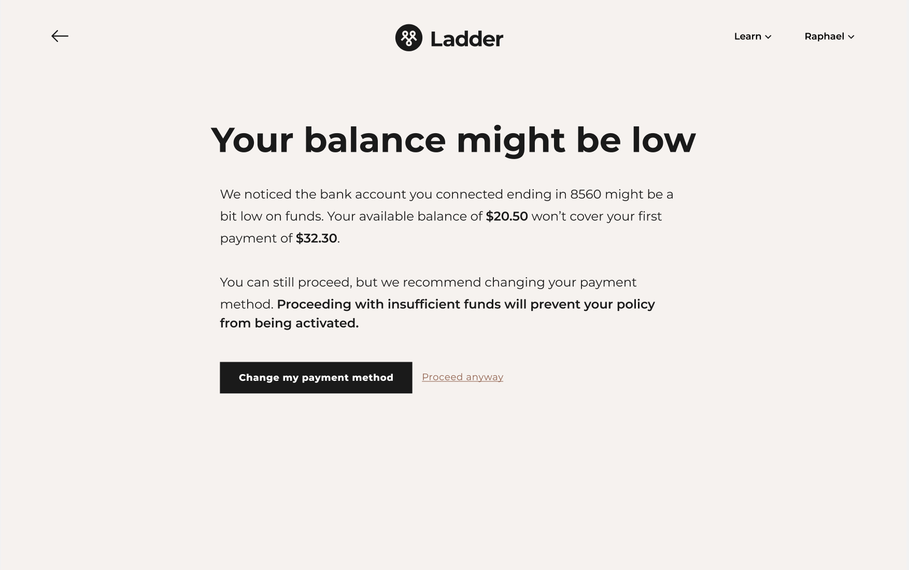
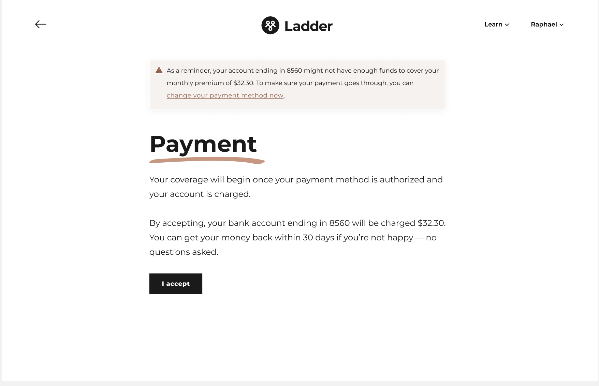
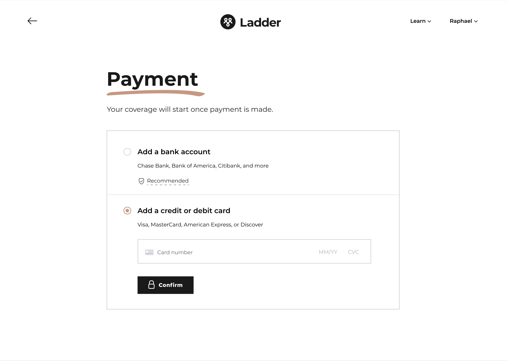
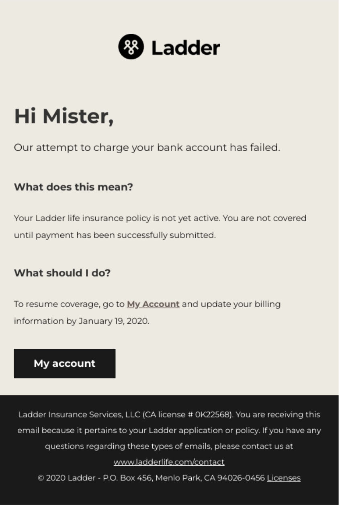
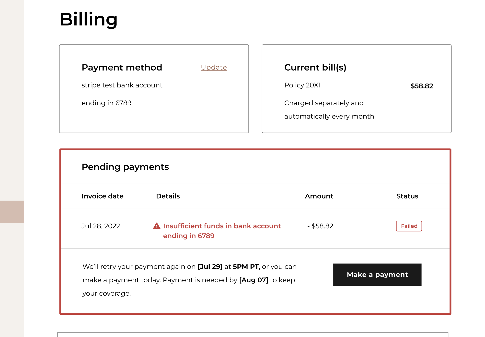
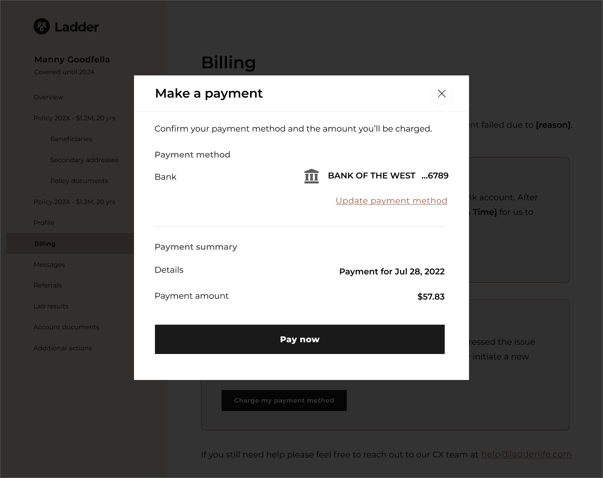
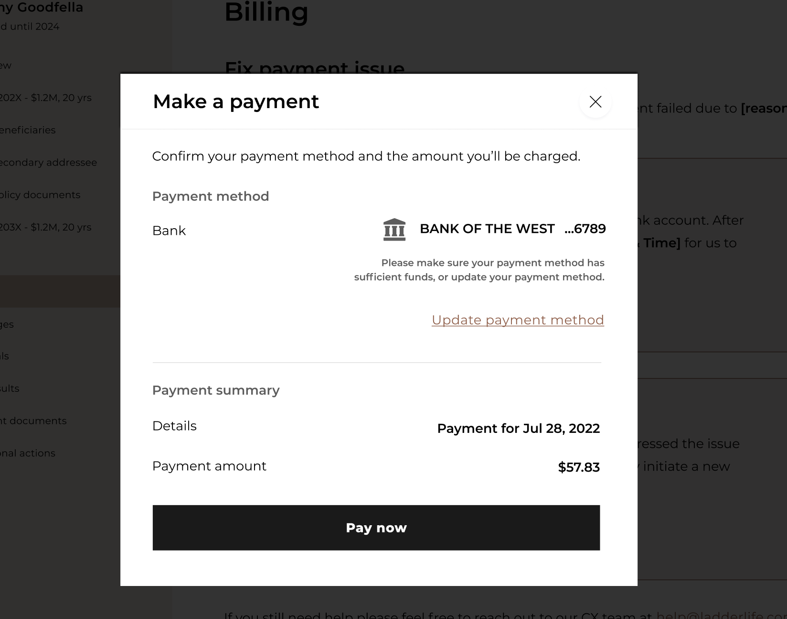

<visual>

<content-title>
First Payment Failure
</content-title>
<content-excerpt>
Redesigning Ladder's payment experience to reduce payment failures
</content-excerpt>

</visual>

I led the design for a new initiative focused on reducing first payment failure—a key cause of customer lapse. By introducing ACH balance checks, smarter alerts, improved notifications, and a clearer billing experience, we cut first payment failures by 50%, saving ~130 policies from lapsing each month.

<prompt-container>
<clickable-prompt prompt="What problem were you solving with this project?" projectContext="Ladder First Payment Failure">What problem did you solve?</clickable-prompt>
<clickable-prompt prompt="What was your process?" projectContext="Ladder First Payment Failure">What was your process?</clickable-prompt>
<clickable-prompt prompt="What constraints shaped your work?" projectContext="Ladder First Payment Failure">What constraints shaped your work?</clickable-prompt>
<clickable-prompt prompt="What impact did it have?" projectContext="Ladder First Payment Failure">What impact did it have?</clickable-prompt>
</prompt-container>

# Background

## Retention as a new focus

<visual>

In mid-2022, I became the design lead for a new product team dedicated solely to customer retention. Ladder had traditionally prioritized customer acquisition over retention for various reasons, but mainly because it was more important to secure customers than to ensure they didn't switch to a competitor or cancel their policy after purchase. Recent data trends, however, indicated that we needed to start focusing more on retention, prompting leadership to spin up a new team. 

</visual>

## Problem: First payment failure

Our team focused on several areas, one of which was reducing customer lapse. By examining our data and gathering qualitative insights from our customer support team, we found that payment failure was a major contributor to customer lapse. Put simply, users who miss a payment—whether their first or a subsequent recurring payment—will lose their coverage after purchasing a policy.

<visual>

We decided to prioritize addressing payment failure first, as it was the most straightforward issue to tackle, yet still had a meaningful impact. Our goal was to prevent customers from missing their first payment.

</visual>

### Looking at the data

We looked at the data to gain a better understanding of the opportunity and impact of reducing first payment failure (FPF). We found that approximately **2.5% of all new customers** who purchase a policy fail to make their first payment. Of that cohort, only **38%** manage to resolve the issue. Although 2.5% may seem small, it accumulates to a significant number of policies that are ultimately cancelled.

### What's causing users to fail their first payment?

Drilling into the data further helped us to understand how users fail their first payment. Users can pay for their policy with either a credit card or by connecting their ACH bank account. **All** **FPF occur for users who connect their ACH account, as they often don't have enough funds in their account to cover the first month's premium**.

<visual>

# Design

To solve for FPF, we decided to design a system that can both prevent a FPF from occurring in the first place and intervene when it does happen. 

</visual>

## Prevention

The first payment occurs right after a user accepts their policy. The user journey will typically look like this: 

To avoid a FPF, we decided to run a balance check on a user's ACH account when they connect through Plaid. If the balance check reveals that the user does not have enough funds to cover the first month's premium, we would notify them and give them the option to pay with an alternative payment method.

### Principles

To help guide the design exploration process, I first came up with a few design principles:

**Inform**

Users should immediately understand that they have insufficient funds in their account. They should also quickly understand the consequences of missing their first payment: specifically that their policy won't be activated. 

**Don't patronize**

Potentially not being able to make a payment can be a sensitive matter. Avoid making users feel like it is their fault.

**Give users freedom**

While missing a first payment would not be ideal for us, we still want to give users the option to continue with their chosen payment method.

### ACH balance check

After a user connects their ACH account and we determined that there are insufficient funds, we would surface this screen to them. From here, they can change their payment method or proceed anyway. 

### Alert

If a user decides to continue with this payment method then we would show an alert on the confirmation page where they give us permission to charge their account. This alert would remind them of the issue and provide one last opportunity to fix the issue. 

### Payment switch

If a user decides to switch their payment from here then we would take them back to the billing page with the credit card option defaulted to nudge them to pay with a credit card instead. 

## Intervention

We implemented measures to intervene and help users fix their FPF in the following scenarios: 

- Users still choose to proceed with an incorrect payment method
- If our balance check came back successful but the ACH account becomes insufficient during the delay before the transaction is completed

These measures include a **revamped notification plan** and a more **robust billing section** in a user's account settings. 

### Notification plan

Once a FPF is detected, users have 10 days to resolve the issue by either adding funds to their account or switching to another payment method. In the past, emails were sent to users during this 10-day period to encourage them to fix their payment issue. After auditing this email campaign, we identified that both the content of the emails and the type of communication could be improved.

I collaborated with our UX writer to make our emails more informative and actionable. I also worked with our product manager to introduce SMS messages along with emails, ensuring that users become aware of the issue.

### Billing section

We also wanted to make it clearer for users that navigate to their billing section in their account settings what the issue is and how they can fix it. Specifically, a user should be able to get the answers to these questions in the billing section: 

1. What payment did I make? (Month of May etc)
2. What is the status of my payment? (Pending, Successful, Failed etc)
3. How much was due? ($100 etc)
4. When was it due? (May 2nd etc)
5. How can I fix the problem? (Make a payment)

I designed a new component in our billing section to answer these questions. This component essentially acts as a status indicator that informs and provides an action for users to take. 

### Making a payment

Prior to this project, fixing a FPF required users to update their payment method to initiate a charge on their credit card or account. This mental model of updating a payment method to fix the FPF issue didn't make sense to me and I felt seemed confusing to users. So instead, I redesigned this mechanism to change the mental model from updating a payment method to making a payment. My reasoning was that if a payment failed, then there must be an outstanding payment to be made.

**Before**

**After** 

I designed a modal that can be reused in various areas of the billing section. It contains two key pieces of information: their saved payment method and a payment summary of the invoice they're paying for and the amount. Users can also update their payment method within this modal.

I also integrated our balance check into the modal if a user proceeds with the same or another ACH payment method that has insufficient funds. 

<visual>

# Results

<callout emoji="📈">
After shipping, we saw a **50% reduction** in first payment failure, leading to about **130 policies saved from lapses** a month.

</callout>

</visual>