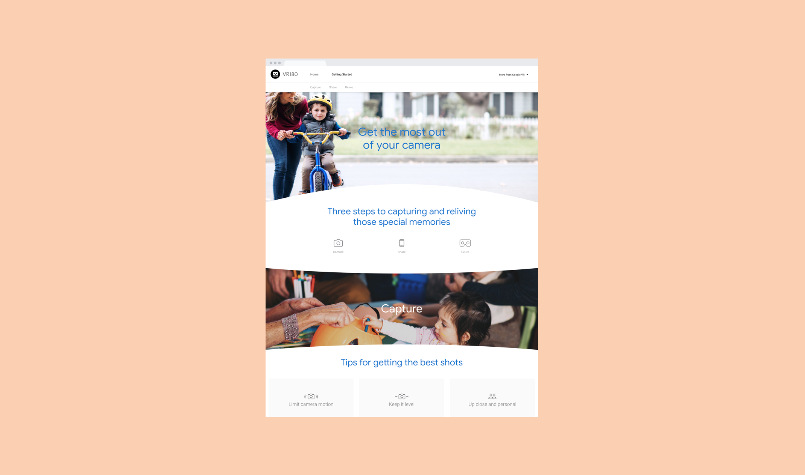
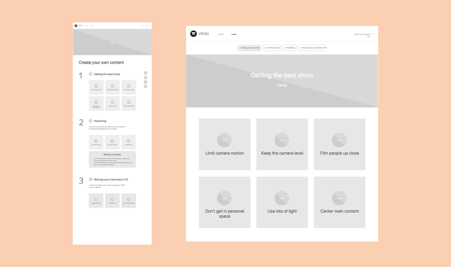
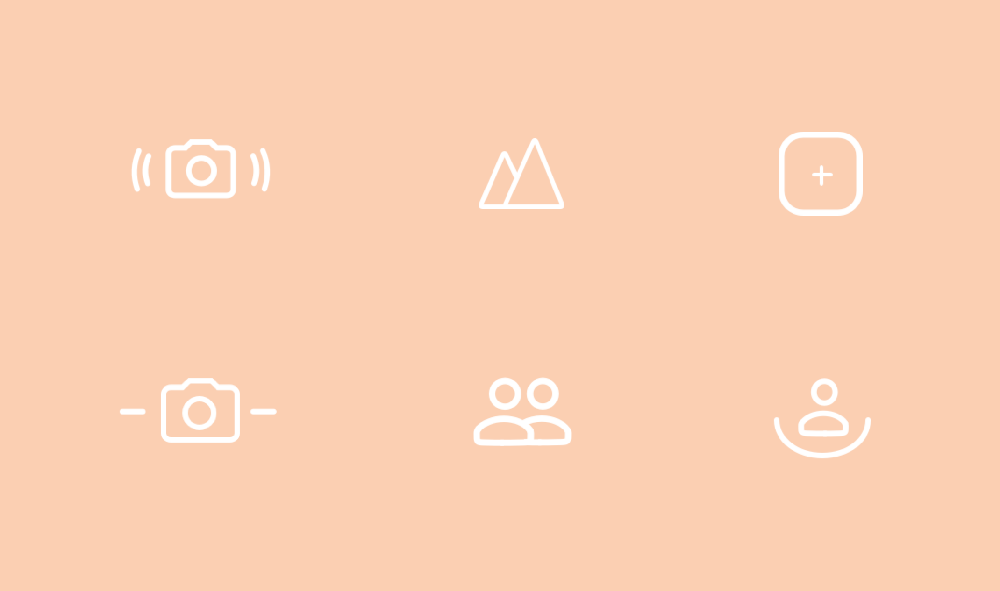
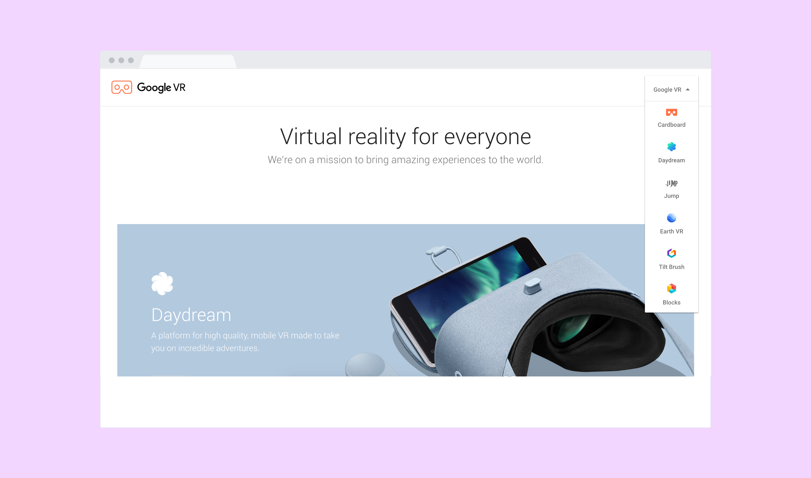
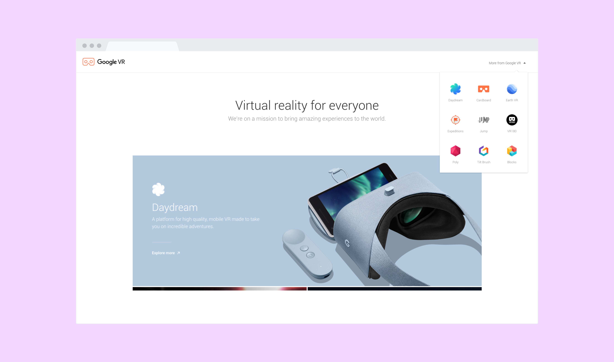
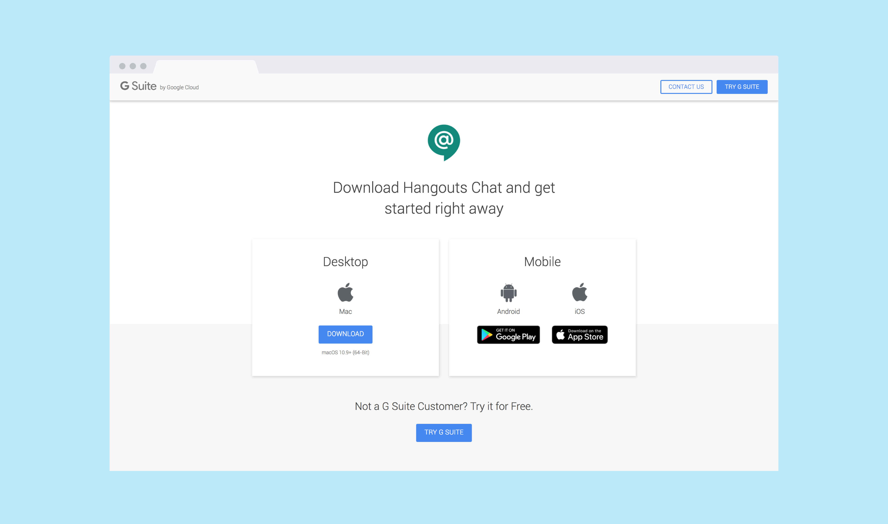

<content-title>
Google
</content-title>
<content-excerpt>
Designing for Google in partnership with Left Field Labs 
</content-excerpt>

#Introduction

I’ve had the privilege of designing for Google’s product pages through working at <a href="https://leftfieldlabs.com">Left Field Labs</a>. Here, I showcase some of the sites I’ve worked on.

#VR180

##Overview

The Google VR180 team needed a website designed and developed in conjunction with the release of the Lenovo Mirage Camera. The webpage would be an addition to the main VR180 site as an instructional page for content creators.

<blog-button>
<button-visit>
<a href="https://vr.google.com/vr180/gettingstarted/">Visit</a>
</button-visit>
</blog-button>

##Role

I was the main designer of the page and was responsible for both the UX (wireframes) and UI (visual mockups) of the page. I also received constant feedback from our team’s UX Lead and Senior Art Director.

##Problem

The main design challenge was the amount and type of content this page would contain. A long and instructional page by nature is boring, and so we had to find ways to make this website experience as smooth and enjoyable as possible.

##Delight the visitors

A page with dry content doesn’t have to be boring! Throughout the design process I brainstormed ways we could use images and motion to make the process of scrolling through this site both fun and enjoyable.

The image headers for each section, for example, didn’t have to be contained within rectangular boxes. Instead, we could build upon the VR motif and crop these images within dynamic and curved containers. Visually, this also makes the page feel more tactile rather than flat.

Also, the tips provided for visitors could both teach and entertain. Instead of presenting the information for each tip upfront, making the tips interactive would garner curiosity and thus an incentive to learn more.

##Prototyping

I also prototyped to help both our client and developers understand how certain interactions work. This helped speed up the process of approving the interactions and saved valuable time that would’ve been used to explain the interactions.

<gif>

</gif>

#Google VR Menu

##Overview

The Google VR team needed a redesign of their website’s navigation menu. This menu would be integrated within most of Google VR product pages. It had to be easily scaleable and follow Google’s brand/standard guidelines. I designed a menu to achieve these goals.

<blog-button>
<button-visit>
<a href="https://vr.google.com/">Visit</a>
</button-visit>
</blog-button>

</content>

My final solution was heavily inspired by a menu that Google was already using within sites such as Gmail, Calendar, and Plus. The benefit of designing this way was adhering to a system that Google is familiar with. Besides following Google standards, this menu is also scaleable as new VR products can easily be added. You simply scroll to find more products.

I also changed the label from “Google VR” to “More from Google VR”. This made the affordance clearer. Moreover, since the initial state is a text link, it can sit on top of moving backgrounds such as in Earth VR and Blocks without having a solid colored background.

A possible trade-off I considered was deciding which products would come first within the menu. Some product links would inevitably be buried beneath the menu fold, potentially upsetting many product teams who’d like their products to come first. A solution that hasn’t been implemented yet would be to alphabetize the order, thus removing any favoritism.

#Google Hangouts Chat

Hangouts Chat is a messaging platform for teams. I was tasked with designing a download page for Hangouts Chat.

<blog-button>
<button-visit>
<a href="https://get.google.com/chat/">Visit</a>
</button-visit>
</blog-button>

