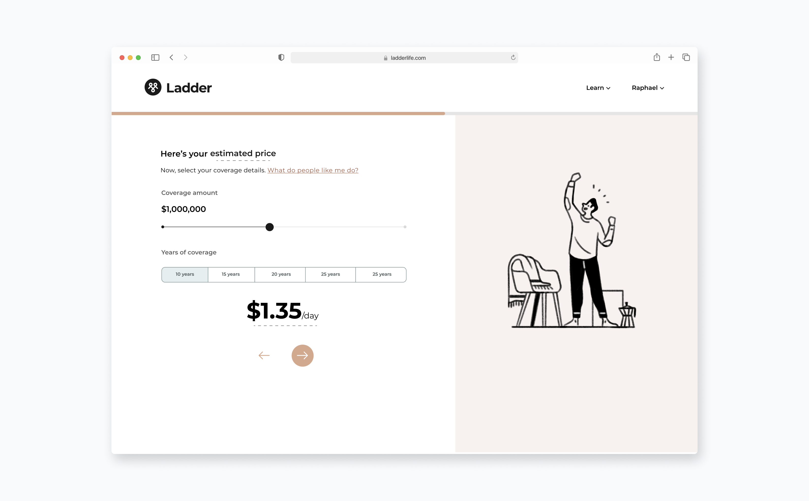
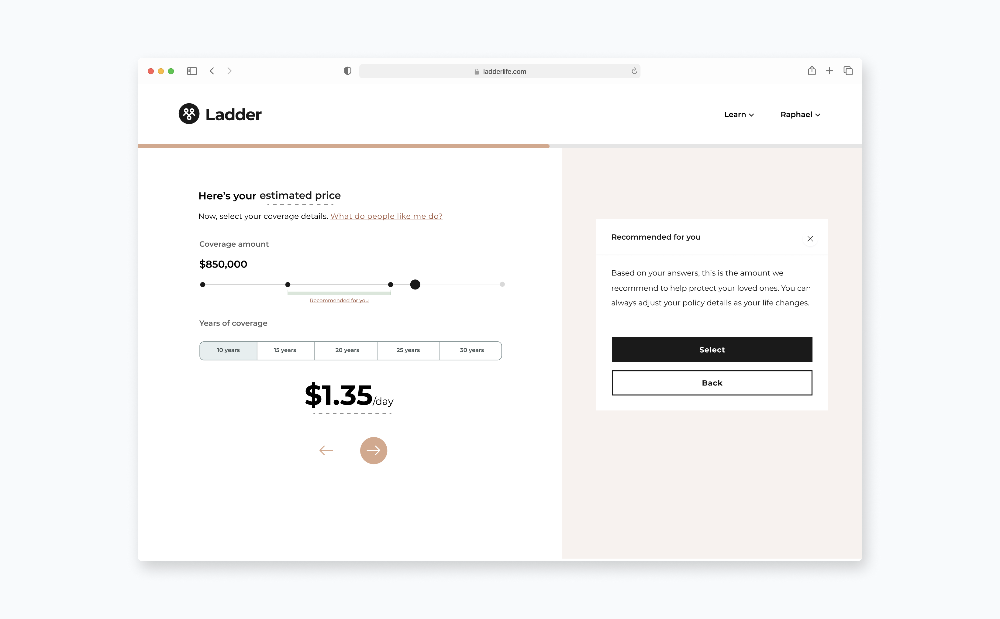
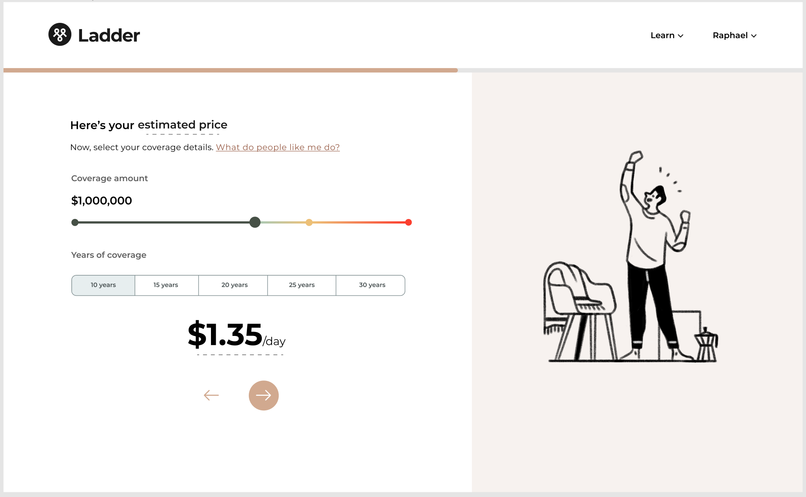
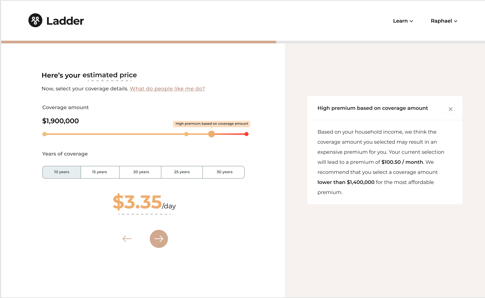
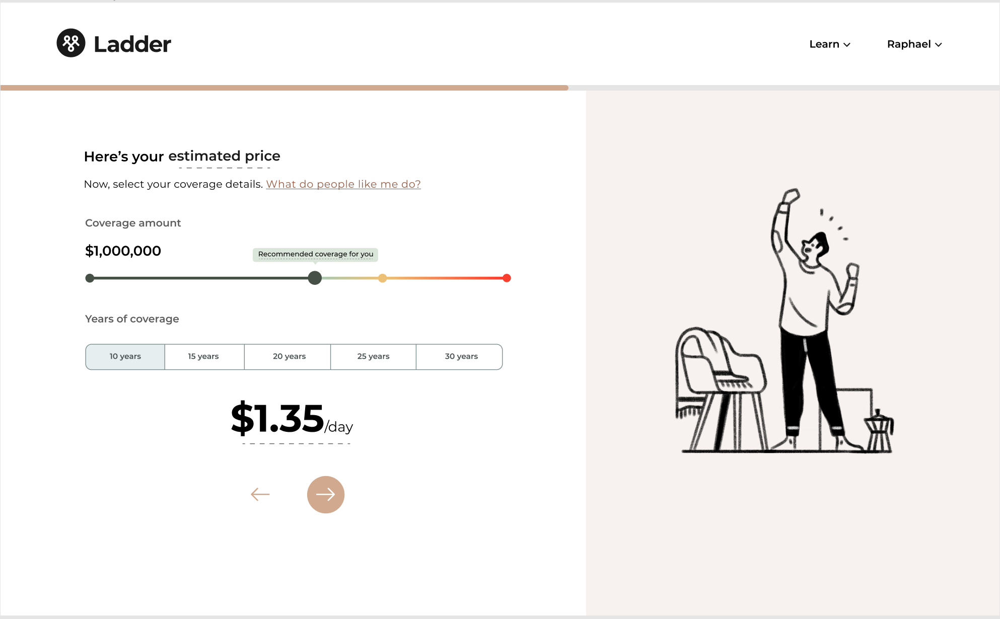
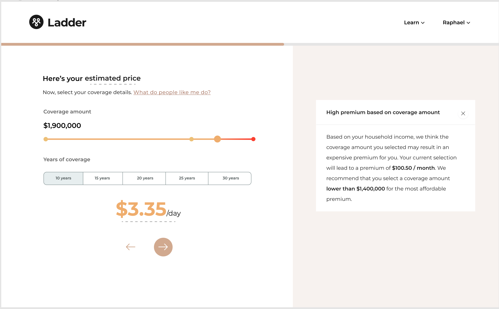
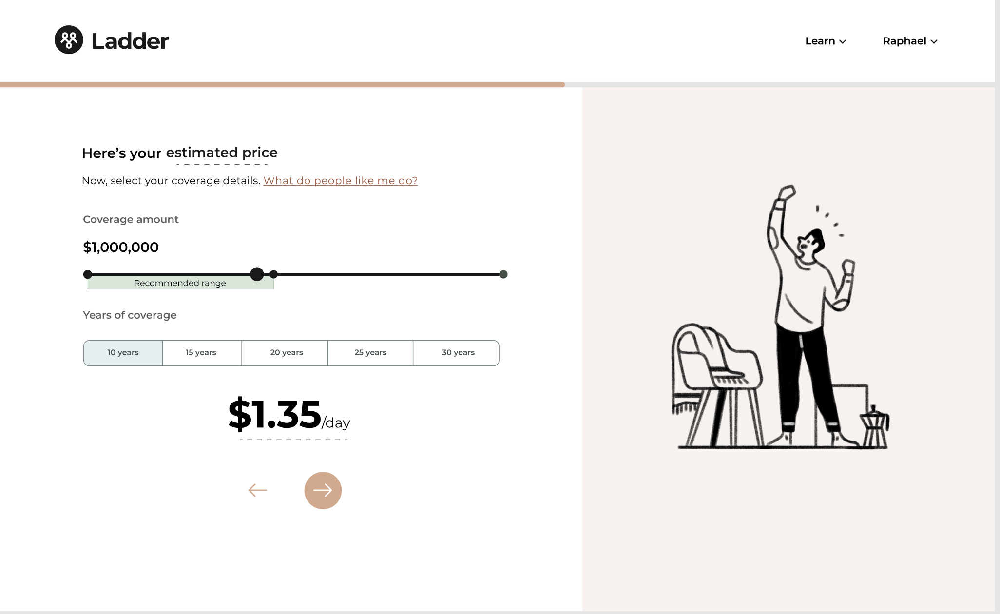
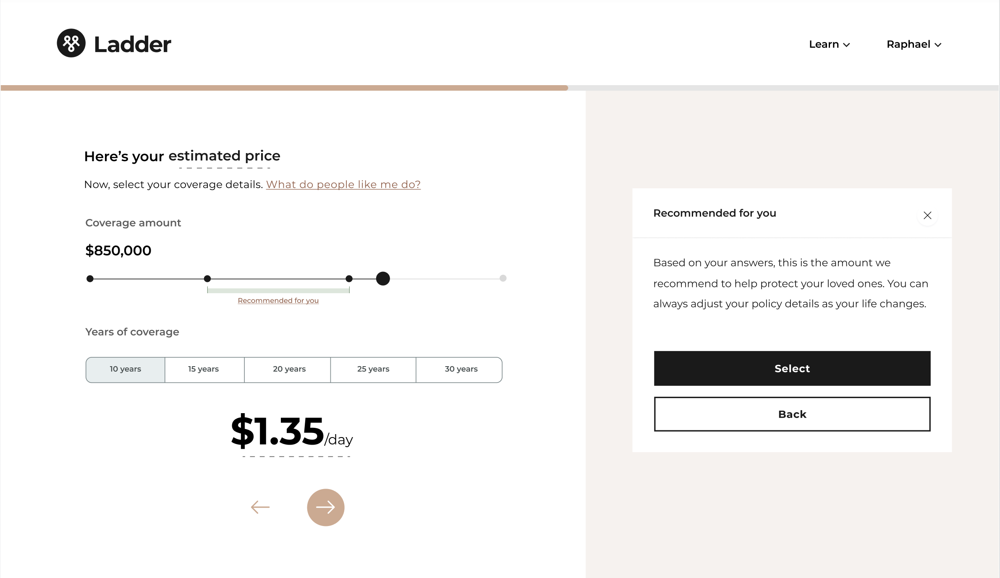
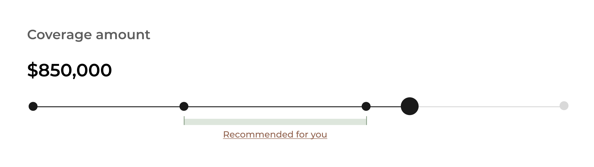
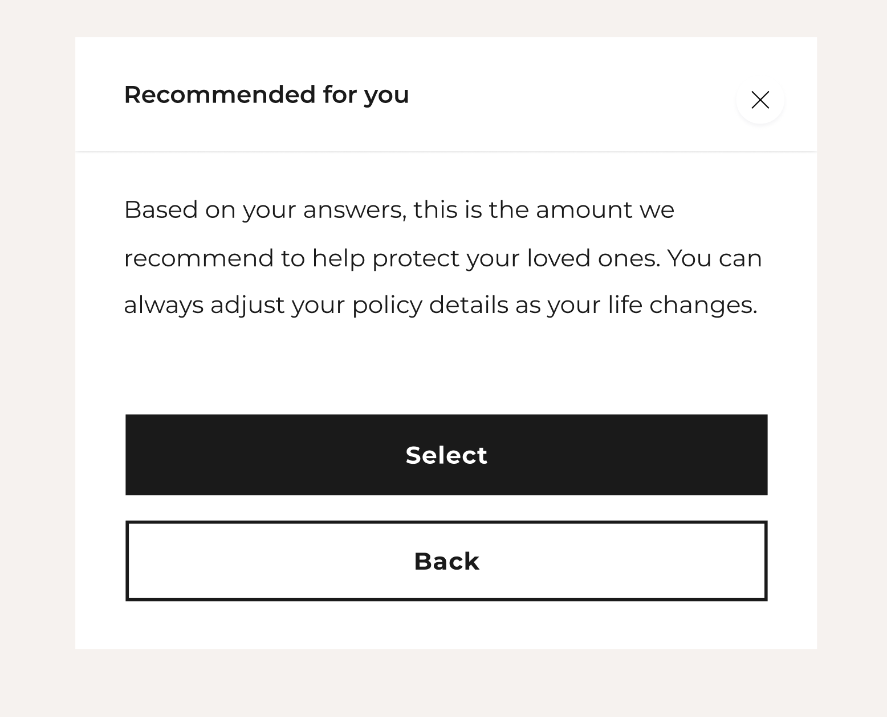

<content-title>
Affordability
</content-title>
<content-excerpt>
Designing an guided coverage slider to help budget-minded users
</content-excerpt>

I designed a lightweight coverage slider with affordability guidance to help users choose policies within budget. This reduced drop-off and led to a 14% lift in policy acceptance, contributing to a 4% increase in overall conversion.

<prompt-container>
<clickable-prompt prompt="What problem were you solving with this project?" projectContext="Ladder Affordability">What problem did you solve?</clickable-prompt>
<clickable-prompt prompt="What was your process?" projectContext="Ladder Affordability">What was your process?</clickable-prompt>
<clickable-prompt prompt="What constraints shaped your work?" projectContext="Ladder Affordability">What constraints shaped your work?</clickable-prompt>
<clickable-prompt prompt="What impact did it have?" projectContext="Ladder Affordability">What impact did it have?</clickable-prompt>
</prompt-container>

# Problem

Ladder's mission is to protect families by helping people get covered through a policy that is right for them. **As policy offers become more expensive, however, the rate of users accepting their policies drops**. Users who feel that life insurance is **outside of their affordable budget will not get the coverage their loved ones need**. And rather than lowering their coverage amount, users elect not to get life insurance altogether due to it feeling unaffordable. This leads to a coverage gap which we are aiming to decrease.

## Goal

Our goal was to design a treatment in our funnel to help users select a policy that fits within their budget. To do this, we used effective design and copy to guide users towards a coverage amount that would result in an affordable policy.

## Success metrics

Increase in number of people taking a policy.

# What we shipped

## Old

## New

# Research

Research conducted by our data science team on the pattern of users taking a policy prompted this project. Through their analyses, they were able to understand the traits of a user in relation to whether or not they would take on a policy, making it possible for us to determine the affordability of a monthly premium for an offer for the user. They developed a model to determine at what point a coverage amount for a policy would make a policy affordable for a user. We only showed the treatment to a certain cohort of users, since affordability isn't a problem for everyone.

# Designs

## Principles

To help guide the design exploration process, I first came up with a few design principles:

### Inform on what we think is affordable

Our treatment would bring value to users by informing them. We assume that users are not only unable to afford a certain policy, but they also don't know they can't afford it until late in the buying experience. In terms of design and copy, this means displaying the necessary information without overwhelming users, so they can tell if the policy they are selecting is unaffordable. 

### Give users freedom

Our goal was to help users select a policy with an affordable coverage amount. However, we did not want to prevent users from selecting a coverage amount that would make the policy unaffordable. In other words, we did not want to impose anything on users. Users have individual needs, and making it difficult for them to get what they need would be a bad experience.

### Don't patronize

Affordability is an important consideration for users, but it can also be sensitive for some. We have their best interests in mind, but we don't want to appear condescending by implying they can't afford a certain policy.

## Explorations

I considered two areas of our flow when designing: the quote page and the offer page. These pages are key points in the journey where users can select a coverage amount for a policy, determining if it is affordable. A majority of the design process was determining where was the best location for the treatment: the quote page, the offer page, or both. Each option had pros and cons to consider. In the end, we decided to test our hypothesis on the quote page first, as it receives more traffic, allowing us to get quick results.

Here are a few design explorations I considered for the quote page:

### Version 1

## Version 2

## Version 3

We realized that versions 1 and 2 were too heavy-handed in their recommendations and brought in unnecessary complexity, so we decided to further refine version 3.

## Shipped solution

### Slider bar

I designed the coverage amount slider bar to include a `Recommended for you` range that would display where users should ideally select. The solution here is to make the range as lightweight as possible so as to not hinder the overall experience of selecting a coverage amount, but still pique a user's interest and be obvious as to what the intention is. 

### Helper text

Clicking on `Recommended for You` would open a box on the right panel displaying helper text. I collaborated with our UX writer to create content that was both informative and vague enough to avoid a patronizing tone.

# Results

<callout emoji="📈">
After shipping, we saw a **14% lift in our success metric,** which after dilution, contributed to **a 4% increase in funnel conversion.**

</callout>