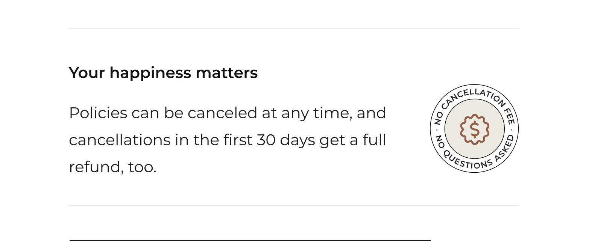

<content-title>
Billing Checkout
</content-title>
<content-excerpt>
Redesigning Ladder's purchase experience to reduce wasted costs and better serve high-intent users.
</content-excerpt>

I redesigned Ladder's purchase flow to focus on high-intent users by auto-issuing matching-price policies and moving billing earlier. Despite initial risks and tension with leadership, the launch increased gross margin by 82% and reduced costs by 64%.

<prompt-container>
<clickable-prompt prompt="What problem were you solving with this project?" projectContext="Ladder Billing Checkout">What problem did you solve?</clickable-prompt>
<clickable-prompt prompt="What was your process?" projectContext="Ladder Billing Checkout">What was your process?</clickable-prompt>
<clickable-prompt prompt="What constraints shaped your work?" projectContext="Ladder Billing Checkout">What constraints shaped your work?</clickable-prompt>
<clickable-prompt prompt="What impact did it have?" projectContext="Ladder Billing Checkout">What impact did it have?</clickable-prompt>
</prompt-container>

# Background

## What is this?

Ladder's mission is to protect families by making it easier for people to secure coverage. Like any product, policies come with costs, which we recover through sales revenue. Over the past few years, our company faced challenges in selling policies efficiently, with revenue impacted by spending on individuals who ultimately didn't make a purchase. In 2024, I designed a solution that transformed how policies are evaluated and purchased, significantly improving our contribution margin.

## My role

I led the design of this project from January 2024 to May 2024. 

In addition, I worked alongside a UX Content Designer, 2 Engineers, and a Product Manager.

My tasks entailed owning the end-to-end design process, defining product strategy, and pairing with developers.

# Problems to solve

Ladder has long faced the challenge of covering users who don't end up purchasing a policy, leading to high operational costs. The purchase journey typically begins with a user receiving a quote, completing an application, and—if everything checks out—reviewing and accepting their offer.

Behind the scenes, Ladder invests resources to underwrite users by evaluating their risk profiles. This process, which we call "evidence," includes gathering medical history, driver's license information, and other data. Based on their application and evidence, we provide an offer for the user to consider.

The challenge arises when users we've invested in for evidence don't accept their offers. Reasons for this include price concerns, lack of readiness, or continued shopping. While these decisions are understandable, they create issues for both users and our business:

1. **User challenges**
    1. Users invest time in our process but may leave without a policy, leaving their families unprotected.
    2. For users who already liked their initial quote, having to accept an offer at the same price adds an unnecessary step in an already lengthy process.
2. **Business challenges**
    1. Spending on evidence for users who don't purchase negatively impacts our contribution margins.
    2. Strong contribution margins are crucial for fundraising in the startup world, where investors prioritize high gross margins. The days of investors casually funding startups without a solid financial foundation are behind us.

# Goals

## Specific goal

Our primary goal was to focus on high-intent users—those who are ready and willing to purchase a policy. In contrast, low-intent users are individuals who are not yet prepared to buy for reasons such as price concerns, needing to consult with family, or continuing to shop around. Through past research, we identified cohorts of users who proceed through our life insurance flow without any intention of purchasing. Our objective was to avoid spending evidence money on these low-intent users.

## Measures of success

- **Increase Policy Growth.** Make it easier for high-intent users to accept their offers, reducing the risk of losing their business due to unnecessary friction in the process.
- **Enhance Contribution Margins.** Accurately gauge user intent to determine if spending evidence costs is justified, thereby reducing wasted resources on low-intent users.

# What we shipped

# My process

Understand → Identify → Execute

## Understand

### Understanding the traditional purchase journey

Most digital life insurance websites follow a similar process. Users start by getting a quote after answering a few basic questions about themselves, receiving a rough estimate of their policy cost. If they're interested, they proceed to a more detailed questionnaire that covers their activities, health history, and even driving records. At the end, they receive a finalized offer, which may differ from their initial quote. If satisfied, they accept the offer and provide billing information to activate their policy.

This step-by-step process—Quote → Questionnaire → Offer → Billing—is a standard approach across digital insurance providers, whether for car, home, or life insurance. Its familiarity helps users to intuitively understand the process. 

### Understanding underwriting

Behind the scenes, accurately assessing a user's risk is essential for generating a fair and competitive price. Ladder leverages a range of digital services to quickly and thoroughly evaluate a user's risk profile. This modern approach eliminates the need for traditional methods like doctor visits and blood tests, making digital life insurance faster and more convenient.

## Identify

### Identifying the approaches

With a clear understanding of the current flow, our team used first principles thinking to brainstorm ways to reconfigure the traditional process. Building on an earlier idea, we hypothesized two potential approaches:

1. **Automatically issuing a policy** if the final price matches the initial quote. The assumption is that users who like their quote and proceed through the application are more likely to accept an offer that matches their initial quote. This approach also eliminates the step of manually accepting the offer. If their final price doesn't match then they would see an offer page to manually accept their policy.
2. **Moving up the billing step** to act as an intent filter. The idea is that requiring billing information earlier forces users to decide whether they truly want a policy. High-intent users would proceed, while low-intent users would drop off. Importantly, evidence wouldn't be pulled until after billing information is provided.

What the flow would look like with these two new approaches

### Identifying the risks

These two approaches marked a significant departure from the traditional purchasing journey familiar to most users, and the risks were substantial. I was concerned that users might be confused about being issued a policy without a traditional offer step, or about being asked for billing information before seeing a formal offer. This could result in negative reviews, frustrated calls to our customer service team, and significant drop-off at the billing stage.

I ensured these risks were clearly communicated not only to our team but also to the leadership team. I'll delve more into this in the design explorations later.

## Execute

### Design explorations

During the exploration phase, I grappled with organizing page components (quote, billing, what will happen after billing). I worked with our UX Content Designer to figure out the right hierarchy and which component to emphasize the most. A huge part of this was the copy itself so it would be remiss of me to not give a shout-out to our Content Designer, Heather, for all the work she did here. 

### Conflict with leadership

One of the risks I identified early was potential confusion around policy auto-issuance. To address this, I advocated for clear messaging that would explain what happens if the final price matches the quote or if it's higher. However, leadership felt this approach was overly cautious and could increase drop-offs. Discussions with leadership became tense at times, as I prioritized the user experience while they focused on business outcomes. Ultimately, we agreed to test an approach that avoided setting too many expectations about what would happen if a user's price didn't match their quote. I'll share more about the lessons I took away from this conflict later.

After extensive collaboration with both the project and design teams, I settled on this version: 

Our approach was to frame this step similarly to a checkout page, providing users with a clear summary of what they're purchasing, the cost, and an opportunity to 'checkout' by entering their billing information.

The price displayed on this page would either match the earlier quote or be higher if their application answers affected it. In cases where the price was higher, I designed a callout to gently encourage users to update their policy details to align with the initial quote they received.

I also brought in a [component from our offer page that has traditionally helped with conversion communicating our cancellation policy.](https://www.notion.so/Offer-Transparency-572e9e6bca2f497bb3d5a19ea015e16c?pvs=21) 

# Results

We launched this project in May 2024 and anxiously monitored the experiment dashboard hourly for the next month and a half. To our relief, no angry customers called in, and while there was some drop-off on the checkout page, it was within normal ranges. Most importantly, we started to see noticeable improvements in our contribution margins.

<callout emoji ="📈">
After shipping, we saw an **increase in gross margin by 82% and a reduction in cost by 64%.**
</callout>

## Impact on company

This project became one of Ladder's most impactful initiatives in 2024. By improving our contribution margins, we created a compelling narrative about the company's current performance and future trajectory—an invaluable asset for fundraising and extending our runway.

# Lessons

The conflict I experienced with leadership taught me two important lessons: 

## Be defensive about your work in a way that still moves thing forward

I realized that my tone and demeanor during discussions weren't always conducive to productive debate. At times, I became visibly emotional, feeling that we might be doing a disservice to our users. In hindsight, I should have approached these moments with more calmness and composure. Staying collected would have likely fostered clearer communication and more constructive outcomes while ensuring all viewpoints were fully understood.

## Conflict can be a good thing

Looking back, I wouldn't have avoided the conflict I encountered. Instead, I learned that respectful and open debate can spark innovation. This idea, often referred to as "creative abrasion," emphasizes the value of engaging with different perspectives to fuel progress and create better solutions. While conflict can feel *uncomfortable,* it's a necessary part of growth. Without it, I don't believe we would have reached the successful solution we ultimately implemented.

