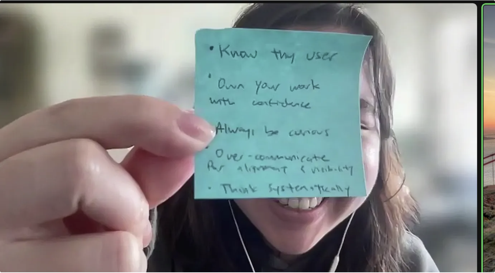
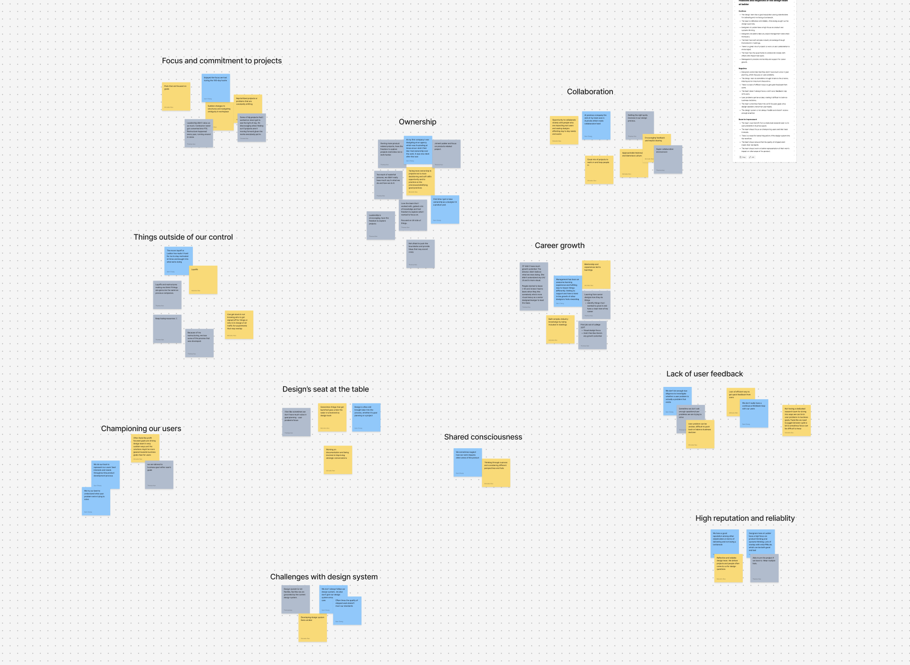

<content-title>
Design Leadership
</content-title>
<content-excerpt>
Growing a strong design team and deepening customer understanding at Ladder.
</content-excerpt>

I lead design at Ladder by growing a cohesive, cross-functional team and fostering customer empathy through guerrilla research and support team insights.

# Introduction

For the past three years, I’ve had the privilege of leading most of our design team (product and visual) at Ladder as a senior product design manager. At Ladder, my two main priorities are building a great team and fostering a customer-centric mindset. I’d like to share some of the ways I’ve worked toward achieving these goals.

# Building a great team

## Team growth

Team growth is crucial because it drives higher-caliber work and greater business impact. A continually growing team develops a diverse skill set, resulting in better-quality outputs. It promotes more informed decision-making, ensuring we solve real problems. And it nurtures strategic thinking, enabling work with greater impact.

### Pairing designers

As a manager, I actively assess the strengths and growth areas of our team members. This helps me pair designers with complementary skill sets on the same project, creating opportunities for mutual growth. For example, someone skilled in systematic thinking can learn from working alongside someone strong in visual and interaction design.

### Career growth

Each team member has a personalized career document outlining their aspirations, current status, potential paths forward, and concrete next steps. This ensures clarity and alignment in their professional development.

### Monthly learnings

Designers are constantly learning through hands-on project work and collaboration. However, in our fast-paced environment, reflection often takes a backseat. To address this, I organize monthly learning sessions where each team member shares insights from their recent experiences. This practice not only solidifies their own learnings but also exposes the rest of the team to diverse problem spaces and approaches.

## Team values

In 2024, I collaborated with our product and visual design teams to define our team values—core beliefs and principles that guide our activities. This effort stemmed from the need to answer two key questions: **What does it mean to be a product or visual designer at Ladder?** and **What truly matters to us, and where do we want to excel?**

Establishing team values helps my team understand who they are and provides a shared framework to guide their work in meaningful ways. It’s a foundation for creating impactful designs that align with their identity and aspirations.

## Team alignment

Team alignment has been a key focus for me since stepping into the design manager role. Historically, designers at Ladder have worked in silos across different disciplines. For instance, product designers and visual designers often operated on separate projects, with little exposure to each other’s work. This disconnect has led to misalignment in insights, business strategy, and goals.

Since taking on leadership of both product and visual design, I’ve prioritized building a shared consciousness within the team.

### Share consciousness

Brian Chesky of Airbnb describes shared consciousness as a singular brain that fosters open communication and collaboration. To cultivate this, I hold monthly team meetings and check-ins to ensure each member understands how their work impacts others—and how others’ work affects theirs. My goal is to create a team where everyone has a general awareness of areas outside their own domain expertise, fostering stronger alignment and collaboration.

# Building a customer-centric muscle

Obtaining user insights has always been a challenge at Ladder. While we have abundant quantitative data, qualitative insights are often harder to come by. Here are a few ways I’ve helped our team better understand our customers:

## Establishing a guerrilla user research team

Without dedicated user researchers, I assembled a team of designers, product managers, and engineers who share a passion for understanding our users. We meet weekly to explore new opportunities for user conversations and experiment with different research methodologies.

## Quarterly customer experience knowledge shares

I also introduced quarterly knowledge-sharing sessions with our customer support team. As the associates who interact with our users the most, they hold a wealth of valuable insights. Each quarter, they share user quotes, data, observed patterns and trends, anecdotal pain points (from both customers and their own experience), problems, and potential solutions. I then distribute these insights to relevant product stakeholders, ensuring they inform our work and decision-making processes.
