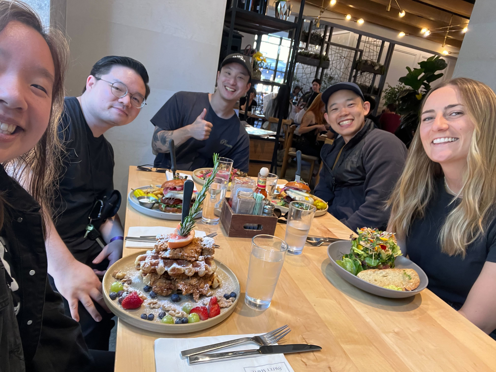
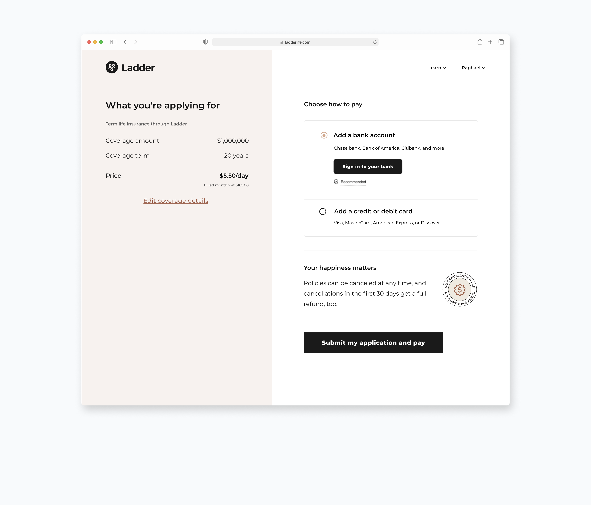
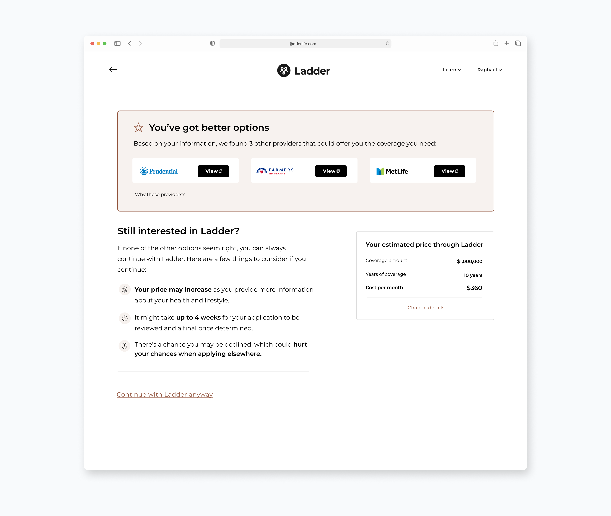

<content-title>
Ladder
</content-title>
<content-excerpt>
Reimagining life insurance for the digital age
</content-excerpt>

Contributed to major redesign and rebrand of entire
platform. Responsible for redesign of application process.
Improved payments conversion by 11%. Created a scalable set of solutions for Ladder's partners. View all projects I worked on at Ladder <a href ="https://samchang.notion.site/0b89e27be0264018bfd23e661651fdd4?v=8f6998c23e9d429cb8cf6dee21dac6fd">here</a>. 

<prompt-container>
<clickable-prompt prompt="What kind of projects did you work on here?" projectContext="Ladder">What kind of projects did you work on here?</clickable-prompt>
<clickable-prompt prompt="Can you describe the scope of your design leadership responsibilities?" projectContext="Ladder">What was the scope your design leadership responsibilities?</clickable-prompt>
</prompt-container>

 

# Introduction

Ladder is an insurtech company that provides term life insurance policies through a digitized process. At Ladder, I currently work on a variety of surfaces, from rethinking how our life insurance application looks to shipping a new payments experience. Here are a selection of projects I've worked on.

# 2024

## Design leadership
For the past three years, I’ve had the privilege of leading most of our design team (product and visual) at Ladder as a senior product design manager. Read below to learn more about my experience leading the team.

<blog-button>
<button-visit>
<a href="/ladder/design-leadership">View case study</a>
</button-visit>
</blog-button>

## Billing checkout
Over the past few years, our company faced challenges in selling policies efficiently, with revenue impacted by spending on individuals who ultimately didn’t make a purchase. In 2024, I designed a solution that transformed how policies are evaluated and purchased, significantly improving our contribution margin.

<blog-button>
<button-visit>
<a href="/ladder/billing-checkout">View case study</a>
</button-visit>
</blog-button>

# 2023

## Re-route
Ladder’s mission is to protect families by helping people get covered through a policy. Still, we've had setbacks matching everyone with the best policy, which is not great for both our users and Ladder. In 2023, our Machine Learning team developed a model to improve these matches. I helped  design a solution that utilizes this model.

<blog-button>
<button-visit>
<a href="/ladder/reroute">View case study</a>
</button-visit>
</blog-button>

# 2022

## First payment failure
In mid-2022, I became the design lead for a new product team dedicated solely to customer retention. As part of this new team, I designed a comprehensive solution prevent customers from missing their first payment.

<blog-button>
<button-visit>
<a href="/ladder/first-payment-failure">View case study</a>
</button-visit>
</blog-button>

## Affordability 
Ladder’s mission is to protect families by helping people get covered through a policy that is right for them. As policy offers become more expensive, however, the rate of users accepting their policies drops. Users who feel that life insurance is outside of their affordable budget will not get the coverage their loved ones need. And rather than lowering their coverage amount, users elect not to get life insurance altogether due to it feeling unaffordable. I designed a treatment in our funnel to help users select a policy that fits within their budget. 

<blog-button>
<button-visit>
<a href="https://samchang.notion.site/Affordability-4887f28b06d24b699953f17017fc842a">View case study 🔗</a>
</blog-button>

