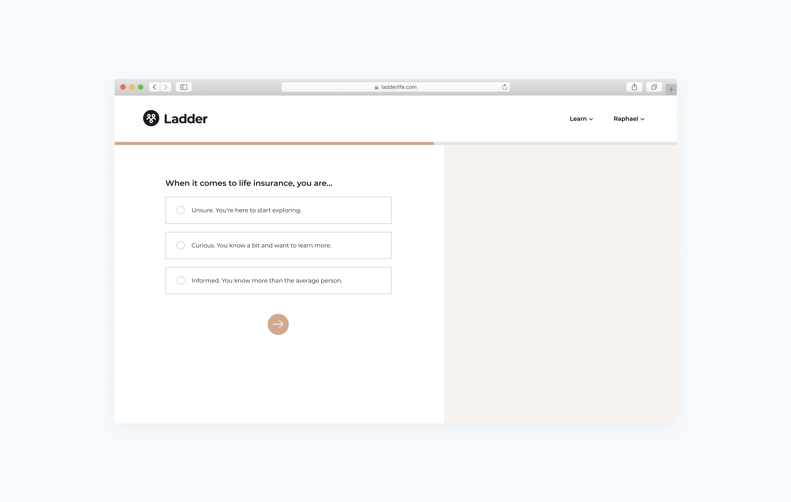

<content-title>
Ladder
</content-title>
<content-excerpt>
Reimagining life insurance for the digital age
</content-excerpt>

Contributed to major redesign and rebrand of entire
platform. Responsible for redesign of application process.
Improved payments conversion by 11%. Created a scaleable set of solutions for Ladder's partners.

#Introduction

Ladder is an insurtech company that provides term life insurance policies through a digitized process. At Ladder, I currently work on a variety of surfaces, from rethinking how our life insurance application looks to shipping a new payments experience. Here are some of the things I've worked on since 2020.

#Homepage redesign
A homepage for a product is a sacred space. It’s where the first interaction between a potential user and your brand occurs. It’s where you’re given your first opportunity to communicate who you are as a company to a potential customer. The homepage encapsulates your identity in one page. And in 2021, I was given the opportunity to rethink and redesign Ladder’s homepage.

<blog-button>
<button-visit>
<a href="https://samchang.notion.site/Homepage-Redesign-1bcac8ca6d3d487eaaf8e7dc9afc52e1">View case study</a>
</blog-button>

#Offer transparency
Our customers value transparency, and transparency can be seen as being concise and clear of Ladder's propositions such as 1) what's covered, or not covered, or 2) Ladder Policies do not have fees, billing fees, late fees, cancellation fees.

<blog-button>
<button-visit>
<a href="https://samchang.notion.site/Offer-Transparency-572e9e6bca2f497bb3d5a19ea015e16c">View case study</a>
</blog-button>

#Ladder rebrand
Over the last three years, Ladder has focused on a brand filled with delight. Everything from the layout to the tone was centered around **making life insurance more approachable**. As the system became more complex, and we learned from each new user interaction, we decided that it was time to enhance our brand identity, therefore implementing a more profound user experience.

<blog-button>
<button-visit>
<a href="https://www.notion.so/samchang/Rebrand-b7e70b171d5b4fb79604bea54ce34428">View case study</a>
</blog-button>

#Billing
As a term life insurance company, Ladder relies on a subscription-based payment model. Users can choose to pay for their policies monthly with either their credit cards or through their bank accounts (ACH).

I was tasked with **improving the conversion metrics for our billing transaction page**—the page where users input either their credit card or ACH information.

<blog-button>
<button-visit>
<a href="https://www.notion.so/samchang/Billing-43818e550ee740c3bfd04394b9f24703">View case study</a>
</blog-button>

#Calculator

Like most life insurance providers, Ladder has a calculator that gives users interested in life insurance an overview of how much coverage they might need. Users will input different information about themselves into the calculator and receive an estimated coverage amount.

<blog-button>
<button-visit>
<a href="https://www.notion.so/samchang/Calculator-607c12d44ba247a99d2a8122f7f638d1">View case study</a>
</blog-button>

#Carousel page

After a user submits a life insurance application with us, we surface an intermediary page that we call the Carousel page. As a user is on this page, we are making a decision whether to offer that user a life insurance policy or not. The Carousel page is thus meant to be a place where users can wait and take a break from inputting information.

<blog-button>
<button-visit>
<a href="https://www.notion.so/samchang/Carousel-Page-cf01e58b1fce4edbaf9cae9f9e76e5d6">View case study</a>
</blog-button>

