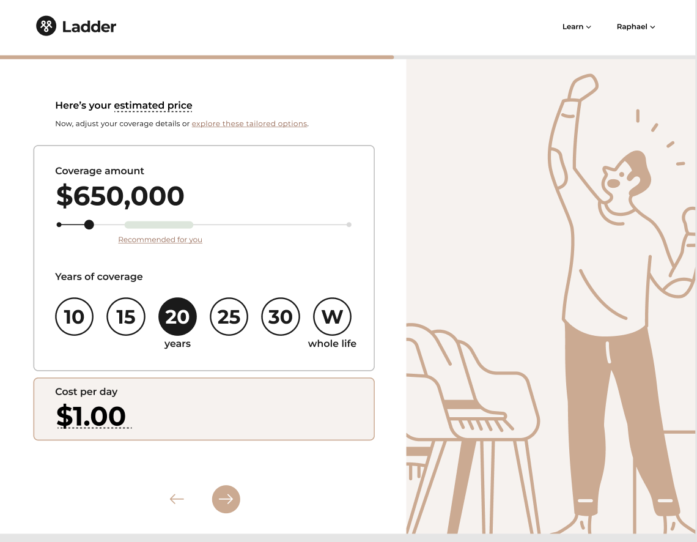

<content-title>
Reroute
</content-title>
<content-excerpt>
Designing a new quote experience powered by machine learning
</content-excerpt>

I led the design of a new quote experience that used a machine learning model to identify low-intent users and redirect them to better-fitting partners. By prioritizing transparency and trust, we increased revenue per impression by ~$4.6–$7.5 and partner impressions by 9%.

<prompt-container>
<clickable-prompt prompt="What problem were you solving with this project?" projectContext="Ladder Reroute">What problem did you solve?</clickable-prompt>
<clickable-prompt prompt="What was your process?" projectContext="Ladder Reroute">What was your process?</clickable-prompt>
<clickable-prompt prompt="What constraints shaped your work?" projectContext="Ladder Reroute">What constraints shaped your work?</clickable-prompt>
<clickable-prompt prompt="What impact did it have?" projectContext="Ladder Reroute">What impact did it have?</clickable-prompt>
</prompt-container>

# Background

## What is this?

Ladder's mission is to protect families by helping people get covered through a policy. Still, we've had setbacks matching everyone with the best policy, which is not great for both our users and Ladder. In 2023, our Machine Learning team developed a model to improve these matches. This project showcases how I designed a solution that utilizes this model.

## My role

I led the design of this project from May 2023 to July 2023. 

In addition, I worked alongside a UX Content Designer, 2 Engineers, and a Product Manager.

My tasks entailed owning the end-to-end design process, defining product strategy, and pairing with developers.

# Problems to solve

Ladder has long grappled with the persistent issue of attempting to cover users who don't buy a policy (i.e. convert), leading to high operational costs. Although users opt out of purchasing policies for various reasons, the primary deterrent is the pricing. Essentially, Ladder offers a policy to a user and the user thinks the price is too high and ends up leaving. This creates problems for both our users and Ladder: 

1. **User problem**: For users, they end up taking the time to go through our flow and decide to leave without a policy and leave their families unprotected. *This affects our mission.* 
2. **Business problem**: For Ladder, we end up incurring operational costs to try to cover a user who ends up not converting. *This affects our profitability.* 

# Machine learning model

Historically, we've always strived to address issues related to conversion and profitability. However, the predictive model developed by our ML team introduced a fresh opportunity for us to devise an entirely new solution.

This predictive model looks at various inputs to make an educated guess about whether a user is likely to buy a policy. Through backtesting we found that a certain cohort of users who decide not to purchase policies are actually costing us money when we consider all the different expenses. 

<callout emoji="💡">
A predictive model is like a special tool that can help us guess what might happen in the future. It looks at information from the past to figure out patterns and connections. Then, using those patterns, it makes educated guesses about things we don't know yet.

</callout>

# Goals

## Specific goal

With this new model, our goal was to identify these unlikely-to-convert users within our flow and redirect them to our partners who can also offer them a life insurance policy.

In the past, we have redirected our users to life insurance partners when we deemed it more beneficial for them. This approach is mutually advantageous: they are more likely to find coverage with our partners, and we avoid incurring operational costs. However, our success in this strategy has been limited due to our restricted understanding of whom to redirect. The newly developed model, though, enhances our ability to make more informed decisions.

## Measures of success

- **Revenue per impression**. This would tell us whether the users who do go through our funnel after seeing the new treatment are actually converting at a higher rate compared to them not being identified by this model.
- **Lift in partner impressions.** This directly translates to revenue generated by taking an identified user through to the model to one of our partners.

# What we shipped

# My process

Understand → Identify → Execute

## Understand

### Understanding the model

One of the most formative lessons I've learned at Ladder, specifically in working in the life insurance space, is how data and design interplay together. Despite the apparent simplicity of the end designs, the decision-making process behind them is complex due to our interpretation of the data.

During this project, a significant part of my time was spent delving into the details of how the predictive model operates. I asked our machine learning engineer various questions about the model, such as the factors it considers, projected revenue for each cohort, and the most compelling traffic slice. While this might not seem like conventional design work, understanding the model's inner workings was crucial for making well-informed design decisions later on.

### Understanding how design fits in here

As I grasped the workings of the model, my understanding of how design would interact with it also evolved gradually. By delving into details such as the specific user cohort targeted by the model and its inputs, I gained a more informed perspective on the language and framing.

We were aware that this model would operate at the quote stage, a relatively early phase in the application process. Focusing on users at this stage, where they've just begun providing some inputs, required designs that could alleviate a potentially jarring experience. Directing a user seeking a quote to explore other life insurance partners immediately upon arrival could be confusing. The design challenge, therefore, involved finding a thoughtful way to communicate to these users that we're not a suitable fit for them.

## Identify

### Identifying the design principles

To help guide the design exploration process, I first came up with a few design principles:

**Be transparent about the problem**

Clearly outlining the problems that a solution addresses makes selling that solution easier. We shouldn't sugarcoat things as a mixed message would actually be more confusing for users. In this case, the design, particularly the copy, needs to explicitly communicate to users the challenges they might encounter by choosing Ladder (e.g., higher prices, potential for rejection, overall mismatch).

**Provide a solution**

Once the problem is presented, the solution should be evident to users. We need to convey that while users are welcome to proceed with Ladder, we strongly recommend considering our life insurance partners as they would be a better fit for them.

**Align with the main user objective**

We know that at this stage, the quote is top of mind for users. While our goal here is to redirect them to our partners, we still have to present them a quote. This doesn't necessarily mean, however, that we have to use our existing quote page (more on this later).

### Identifying the design solutions

A couple questions that I had to answer as I began to explore design treatments include: 

- Where should we surface this treatment?
    - Showing this cohort a price on the quote page may reduce confusion. They came for a quote, and presenting it earlier could pose issues.
    - I also considered displaying it after they've received a quote. However, data shows a substantial drop-off on the quote page. Showing the treatment afterward means those users who dropped off wouldn't have seen it. This is crucial as we generate revenue from the redirected users to life insurance partners.
- Should we use the same quote page we have today?
    - Given that the larger goal is to divert users at this point, we should be open to rethinking this version of the quote page and not feel constrained in using the exact experience we have today… i.e. feel free to rethink the quote page to optimize for this re-route experience
    

## Execute

### Design explorations

During the exploration phase, I grappled with organizing page components (quote, problem, solution). I worked with our UX Content Designer to figure out the right hierarchy and which component to emphasize the most. A huge part of this was the copy itself so it would be remiss of me to not give a shout-out to our Content Designer, Heather, for all the work she did here.

After extensive collaboration with both the project and design teams, I settled on this version: 

We chose to highlight better alternatives to Ladder upfront, favoring immediate presentation over placing them lower on the page. There was debate within the team—some favored showing the quote or potential problems first. My instinct was that elevating partners early in the hierarchy would communicate their importance to users. This is also coupled with the fact that we generate more revenue from users who visit these partners. 

Directly beneath the partner options are the potential problems users could face if they proceeded with Ladder and their quote. I paired these two components as the initial bullet point about their price increasing complemented the quote on the right. This also downplayed the quote slightly which, again, from a hierarchal point of view made sense. 

### De-risking

With a potential design in view, I decided to de-risk our solution by presenting this design in front of our users. I created a user test plan that took users through our flow with this treatment. I was most curious about how jarring this page would be for users who came for a quote and what would make them more compelled to check out the other partners. 

Surprisingly, users were very receptive to the transparency of the page and thought it actually created more trust for Ladder. They liked how Ladder wasn't just trying to make money and were willing to lose out on potential business with them if it meant they could get better coverage elsewhere. 

I also learned that we had to provide a bit more detail on who these partners are and why exactly Ladder is less likely to offer the coverage they need. 

Users also found that the page was a bit jarring to see immediately after providing the last input. To mitigate this feeling, I came up with a transitional loading page that gave a bit more transparency around what we were doing in the backend. I asked our engineer to create some artificial delay on this page to further reinforce the idea that we're doing our due diligence with the inputs they have provided so far. 

# Results

<callout emoji ="📈">
After shipping, we saw an **increase of ~$4.6~$7.5 in revenue per impression** compared to Control, and a **9% increase in partner impressions**.
</callout>