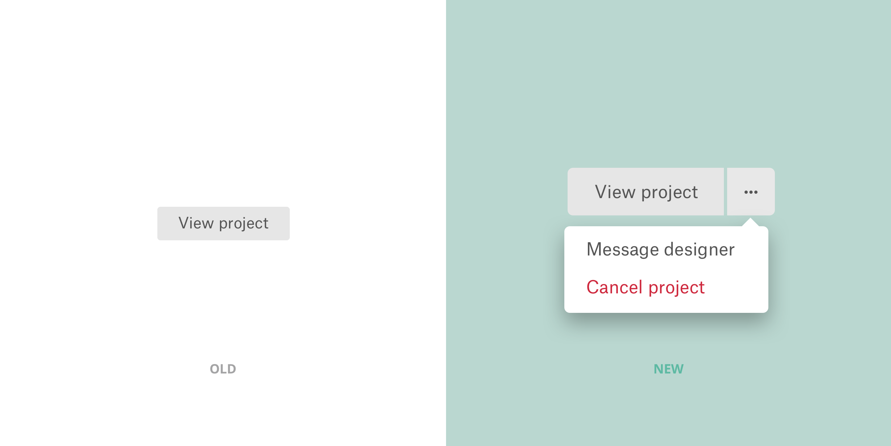

<content-title>
Your Work
</content-title>
<content-excerpt>
Redesigning the client project management experience for 99designs
</content-excerpt>

I redesigned a dashboard to empower clients. This redesigned client experience helped speed up their workflows and encouraged them to engage more with the people they work with.

# Introduction

## Background

I joined <a href="https://99designs.com">99designs</a> in June 2018 as a product designer on our Designer Discovery team. One of the products that our team is responsible for is “Your work”, a consolidated dashboard for clients that presents their contests, direct work, and drafts. My first major project at 99designs was to help redesign this product.

## Problem Framing

The last time Your work received any major updates was in 2015. Back then, 99designs was primarily operating a contest business model and thus Your work was fairly straightforward in terms of functionality. Now, as 99designs is shifting towards a more direct-work business model it was time to refresh Your work.

Specifically, we wanted to speed up the workflows of our clients by <strong>highlighting meaningful and actionable information</strong> and providing tools to allow them to <strong>easily find and manage their work</strong>.

## My Involvement

I worked on this project with my design lead, <a href="https://twitter.com/caioab">Caio Braga</a> (he’s awesome, btw). I helped Caio out by designing interfaces, thinking of new interaction paradigms, and continuously presenting our work to the rest of our design team.

Caio had already given this project much thought before I joined 99designs, so I was fortunate to be building on top of his ideas and further pushing the project forward.

Towards the end of the project I led a few test sessions to learn the impact of our redesign. More on that later…

# Initial Research

We first interviewed seven clients and gathered quotes, insights and qualitative data to get a better sense of how clients interact with our product and make more informed decisions for Your work.

A repeated theme that came up during our interviews was that clients want to <strong>manage their designers as efficiently as possible</strong>. Specifically, they want to <strong>spend less time dealing with repetitive tasks such as referencing past briefs</strong>.

Our takeaway was that features such as search, filtering, and quick actions will save clients considerable time—especially for repetitive tasks such as copying briefs.

# Design

The design process was centered around continuous iteration. I explored various layouts and interaction patterns to share with my team for feedback. From that feedback I’d go back and explore new ideas.

Here are some of the changes we ended up making:

## Sidebar

We changed the navigation pattern from a pill pattern to a sidebar pattern. We felt that a sidebar is easier to navigate and more refined than the pill pattern. A sidebar is also more scalable as we might need to add more options in the future.

## Avatars

We added designer avatars to each listing item in order to help clients quickly recognize who’s working on their project. This is especially useful for the clients who expressed frustration with finding designers that they’ve worked with.

Since multiple designers are in a contest, we thought that showing clients multiple avatars would help them not only quickly see who’s in their contests, but also distinguish contests from direct work (direct work items only show 1 avatar). I explored a couple of ideas for how we can display these avatars as well the number of entries and designers.

## Actions

We also gave our clients different actions that they can take for each project depending on the stage of the project. I went through each of the stages for both contests and direct work and listed the most useful actions clients can take. The decisions I made were based on the client interviews we conducted, discussions with our product manager, and intuition.

I also took the time to see how we can show these action buttons in mobile since space was a major constraint.

## Context Messages

We also added context messages for each project depending on the project stage. Information such as quote amount or completion requests would be displayed here. Again, this is to help clients get an early snapshot of where their projects are at to make quick decisions. One consideration we made when deciding on what messages to show was our current notification system. While we wanted to display useful messages, we also didn’t want to replace our notifications with them.

# Constraints

We didn’t get to ship search and filter features as well as test throughout the design process because of constraints such as time and other product initiatives.

# User Testing

After shipping everything, I led several user testing sessions to learn how the refreshed Your work is delivering value for our clients.

From these tests we learned that:

- Almost all clients successfully navigated through Your work.
- Almost all clients had no issues with the new quick actions and found the contextual messages to be both relevant and helpful.
- All clients thought that Your work is straightforward and grasped the rationales behind each new design change/addition.

# Takeaways

## No perfect solution

Even though our goal was to deliver value for our clients (e.g. speeding up their workflow), not achieving that goal for everyone isn’t necessarily a “bad” thing. At best, the changes improve their workflow and at worst, they don’t affect any change. Every client is different and has a different workflow which means that there isn’t a one-size-fits-all approach to making everyone’s experience better.

## An invisible refresh

Interestingly, most clients didn’t even notice the changes we implemented and yet were still able to successfully navigate through Your work. Sometimes it’s okay and even desirable if our customers don’t immediately notice a change. If they’re able to still quickly get in and out and accomplish their goals, then that’s a win for us.

## Share work often

Part of what made this project so fun was getting to constantly share my designs with the rest of our team. Whether it was through sending a Sketch Cloud link through Slack, or sharing my Sketch window through Zoom with a teammate, sharing my work gave me valuable feedback and created alignment within our team.

# Special Thanks

**Design lead**: Caio Braga. **Product**: Jason Aiken. **Engineering**: Matthew Diamant, Vy Cu, Robert McNeil, and Dan Williams.
